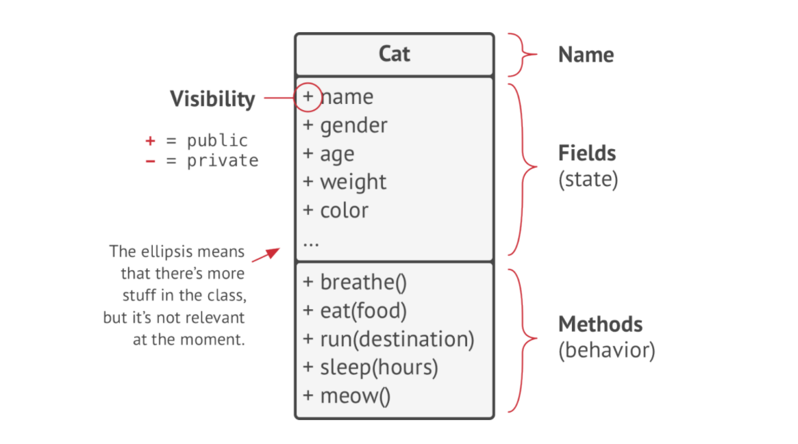
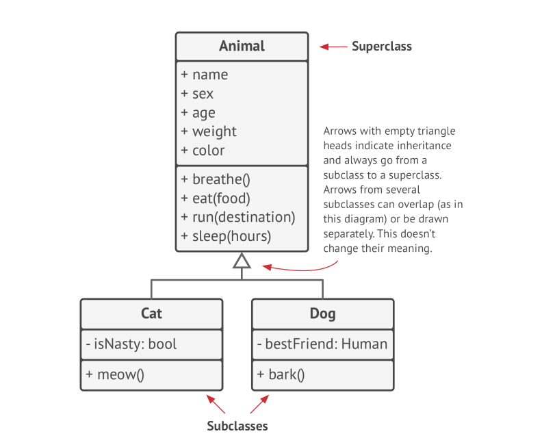
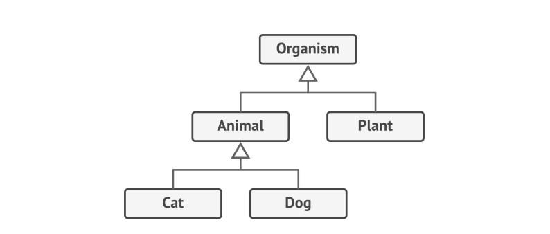
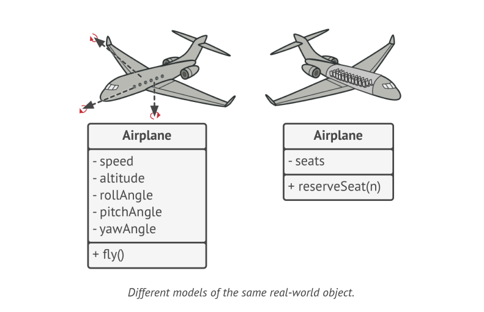
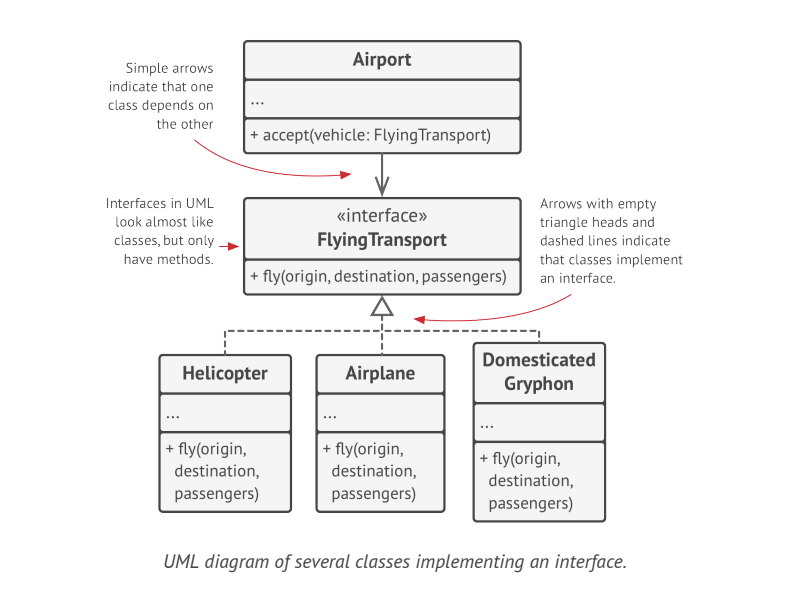
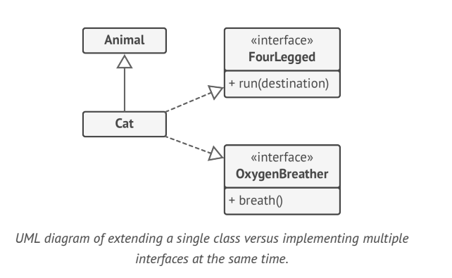

# Object-Oriented Programming

### UML Representation of Class

### Difference between Class and Object?
**Class** is like a blueprint that defines the structure for **Objects**. Objects are concrete instances of the Class.

### What are members of a Class?
Collectively **fields and methods** in a class are referenced as the **members** of the Class.

### What is state?
**Data** stored inside the Object's fields is often referenced as **state** and all the Object's methods define its behavior.

### UML Representation of Inheritance

### What is Abstraction?
Abstraction is a model of a real world object or phenomenon, limited to a specific context, 
which represents all details relevant to this context with high accuracy and omits all the rest.

### What is Encapsulation?
Encapsulation is the ability of an Object to hide parts of its state and behaviors from other Objects, 
exposing only a limited interface to rest of the program.
---

To encapsulate something means to make it private or protected, and thus accessible only from within methods of its Class or SubClasses.

---

Interfaces & abstract classes/methods of most programming languages are based on the concepts of abstraction and encapsulation.

### UML Representation of Classes and Interface

### Inheritance
Inheritance is the ability to build new classes on top of existing ones. The main benefit of inheritance is code reuse.

> If super class implements an interface, all of its subclasses must also implement it.

### Polymorphism

Polymorphism is the ability of a program to detect the real class of an object and call its implementation even when its real type 
is unknown in the current context.

Polymorphism is the ability of an object to pretend to be something else.

### UML Representation of Association Relationship

### UML Representation of Dependency Relationship

### UML Representation of Composition Relationship

### UML Representation of Aggregation Relationship

