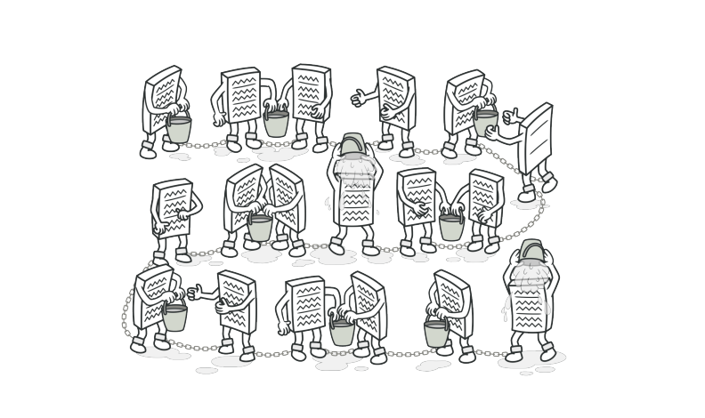
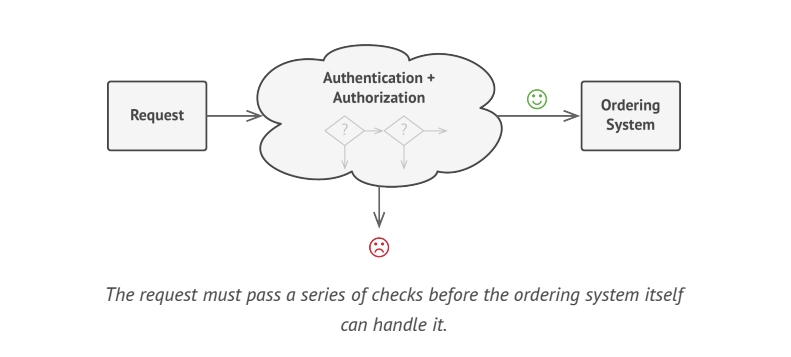
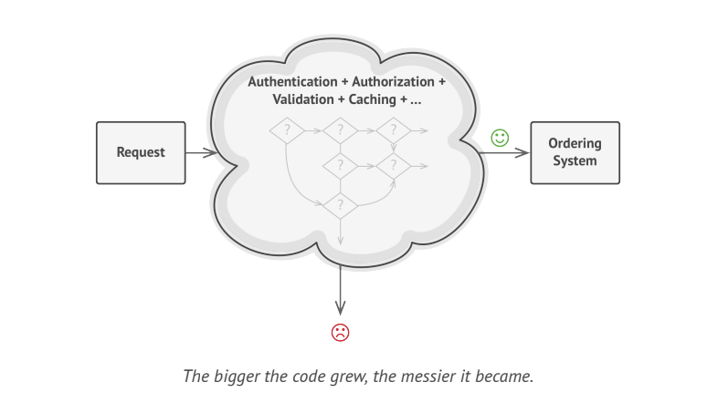
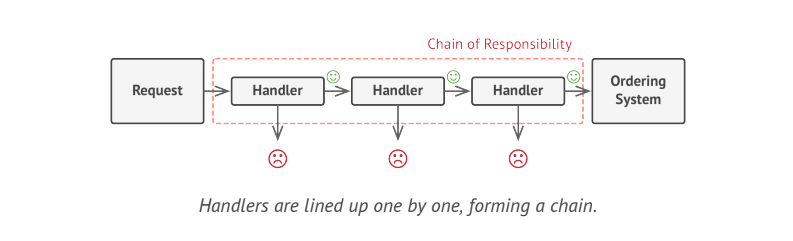
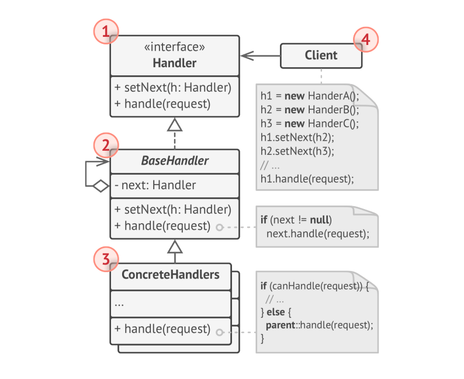

# Chain of Responsibility(CoR)

> **Chain of Responsibility** is a behavioral design pattern that lets you pass requests along a chain of handlers. Upon receiving a request, each handler decides either to process the request or to pass it to the next handler in the chain.

### Problem

Imagine that you are working on an  online ordering system. You want to restrict access to the system so only authenticated users can create orders. After a bit of planning, you realized that these checks must be performed sequentially. The application can attempt to authenticate a user to the system whenever it receives a request that contains the user's credentials. However, if those credentials are not correct and authentication fails, there is no reason to proceed with any other checks.

During the next few months, you implemented several more of those sequential checks.
* You thought that it is unsafe to pass raw data straight to the ordering system. So you added an extra validation step to sanitize the data in a request.
* You noticed that system is vulnerable to brute force password cracking. To negate this, you promptly added a check that filters repeated failed requests coming from teh same IP address.
* You thought you could speed up the system by returning cached results on repeated requests containing the same data. Hence, you added another check which lets the request pass through system only if there is no suitable cached response.

The code of the checks, which had already looked like a mess, became more and more bloated as you added each new feature.

### Solution

The **CoR** relies on transforming a particular behaviors into stand-alone objects called _handlers_. Each check should be extracted to its own class with single method that performs the check. The request, along with its data, is passed to this method as an argument.

The pattern suggests that you link these handlers into a chain. Each linked handler has a field for storing a reference to the next handler in the chain. In addition to processing a request handlers pass the request further along the chain. The request travels along the chain until all handlers have had a chance to process it.

A handler can decide not to pass the request further down the chain and effectively stop any further processing.

 > However, there is a slightly different approach in which, upon receiving a request, a handler decides whether it can process it. If it can, it doesn't pass the request any further. So it's either only one handler that processes the request or none at all. This approach is very common when dealing with events in stacks of elements with in a graphical user interface.

### Structure

* The **Handler** declares the interface, common for all concrete handlers. It usually contains a single method for handling requests. But sometimes it may also have another method for setting the next handler on the chain.
* The **Base Handler** is an optional class where you can put the boilerplate code that's common to all handler classes. This class defines a field for storing a reference to the next handler. The class may also implement the default handling behavior: it can pass execution to the next handler after checking for its existence.
* **Concrete Handlers** contain the actual code for processing requests. Upon receiving a request, each handler must decide whether to process it and additionally whether to pass it along the chain.
* The **Client** may compose chain just once or compose them dynamically, depending on the application's logic.

> **NOTE**: A request can be sent to any handler in the chain  - it doesn't have to be the first one.

### Applicability

* Use the CoR pattern when your program expected to processes different kinds of requests in various ways, but exact type of requests and their sequences are unknown beforehand.
* Use CoR pattern when it's essential to execute several handlers in a particular order.
* Use CoR pattern when the set of handlers and their order are supposed to change at runtime.
