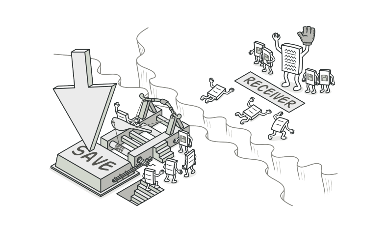
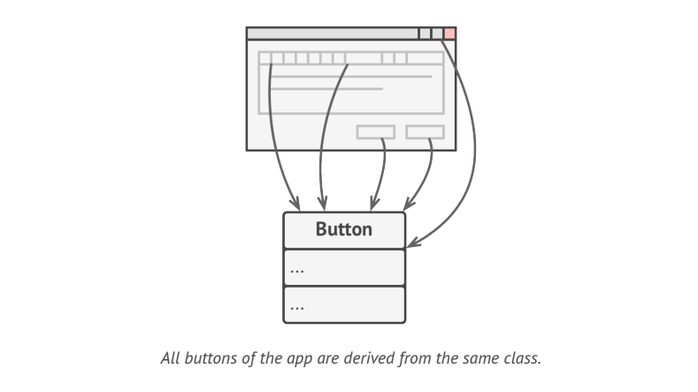
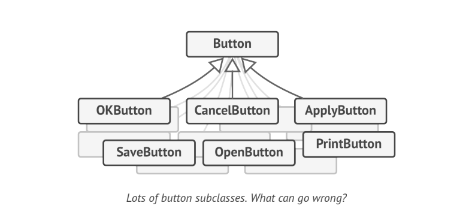
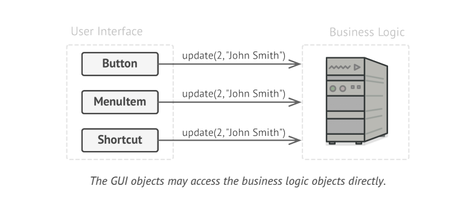
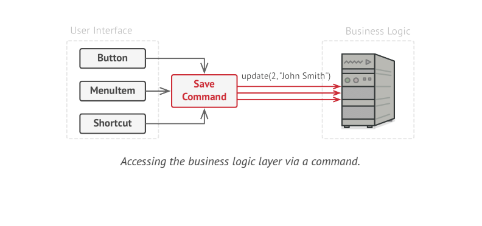
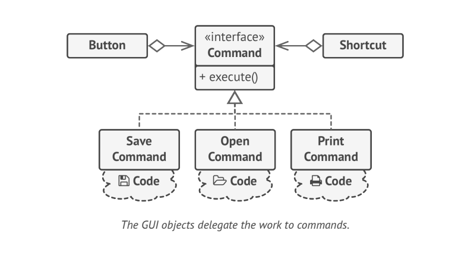
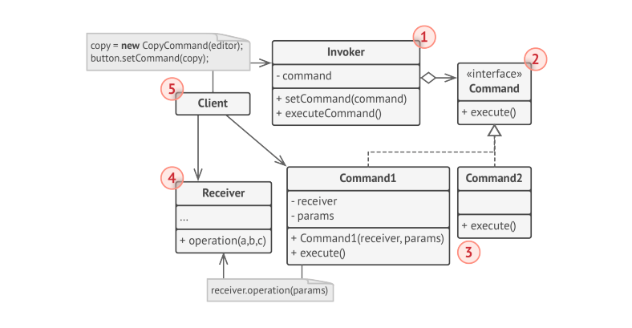

# Command

> **Command** is a behavioral design pattern that turns a request into a stand-alone object that contains all information about the request. This transformation lets you parameterize methods with different requests, delay or queue request execution  and support undoable operations.

### Problem

Imagine that you are working on new text editor app. Your current task is to create a new toolbar with a bunch of buttons for various operations of the editor. You created a very neat _Button_ class that can be used for buttons on the toolbar, as well as for generic buttons in various dialogs.

While all these buttons look similar, they're all supposed to do different things. To get all buttons to work as intended, the simplest solution is to create tons of subclasses for each place where the button is used.

This approach is deeply flawed. First, you have an enormous number fo subclasses and that would be okay if you weren't risking breaking the code in these subclasses each time  you modify base _Button_ class. Put simply, you GUI code has become awkwardly dependent on the volatile code of the business logic.
And here's the ugliest part. Some operations such as copying/pasting would need to be invoked from multiple places. Having the code for copying text inside _CopyButton_ subclass was fine. But then, when you implement context menus, shortcuts and other stuff, you have to either duplicate the operation's code in many classes or make menus dependent on buttons, which is even a worse option.

### Solution
Good Software design is often based on the principle of **separation on concerns**, which usually results in breaking an app into layers.
The GUI layer delegates the work to the underlying layer of business logic. A GUI Object calls a method of business logic object, passing it to some arguments. This process is usually described as one object sending another a _request_. 

The **Command** Pattern suggests that GUI objects shouldn't send these requests directly. Instead, you should extract all the request details, such as the object being called, the name of the method and the list of arguments into separate command class with single method that triggers this request.

**Command** Objects(interfaces) serve as links between various GUI and business logic Objects. The GUI Object just triggers the command, which handles all details.

The next step is to make your commands implement the same interface. Now you can switch command Objects linked to the sender, effectively changing the sender's behavior at runtime.

You'll implement a bunch of _command_ classes for every possible operation and link them with particular buttons, depending on the button's intended behavior.
The elements(buttons) related to the same operations will be linked to the same _commands_, preventing any code duplication.
**Commands** become convenient middle layer that reduces coupling between the GUI and business logic layers.

### Structure

* The **Sender** class is responsible for initiating requests. This class must have a field for storing a reference to **Command** Object. The sender triggers that command instead of sending request directly to the receiver.

> NOTE: The sender Object is not responsible for creating Command Object. Usually it gets pre-created command from client via the constructor.

* The **Command** interface usually declares just a single method for executing the command.

* **Concrete Commands** implement various kinds of requests. A concrete command isn't supposed to perform the work on its oww, but rather to pass the call to one of the business logic Objects. 

* The **Receiver** class contains some business logic. Almost any Object can act as receiver. Most commands only handle the details of how a request is passed to the receiver, while the receiver itself does the actual work.

* The **Client** creates and configures concrete command Objects. The client must pass all the request parameters, including the receiver instance, into to the command's constructor. After that the resulting command may be associated with one or multiple senders.

### Applicability

* Use the Command pattern when you want to parameterize objects with Operations.
* Use the Command pattern when you want to queue operations, schedule their execution, or execute them remotely.
* Use the Command pattern when you want to implement reversible Operations.
