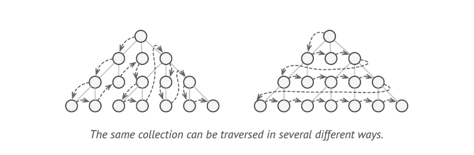

# Iterator

> **Iterator** is a behavioral design pattern that lets you traverse elements of a collection without exposing its underlying representation(list, stack, tree etc.,)

### Problem

A Collection is just a container for a group of Objects

Most Collections store their elements in simple lists. However, some of them are based on stacks, trees, graphs and other complex data structures.
But no matter how a collection is structured, it must provide some way of accessing its elements so that other code can use these elements.

This may sound like a easy job if you have a collection based on a list. You just loop over all the elements. But how do you sequentially traverse of a complex data structure  such as tree?

The clients code that supposed to work with various collections may not even care how they store elements. However, since collections all provide different ways to accessing their elements, you have no option other than to couple your code to the specific collections classes.

### Solution

The main idea of **Iterator** pattern is to extract the traversal behavior of a collection into a separate object called an _iterator_. An iterator Object encapsulates all the traversal details, such as current position and how many elements are left till the end.

Iterators provide one primary method for fetching elements of the collection. The client can keep running this method until it doesn't return anything, which means that the iterator has traversed all the elements.

All iterators must implement the same interface. This makes the client code compatible with any collection type and any traversal algorithm as long as there is a proper iterator.

### Structure

* The **Iterator** interface declares the operations required for traversing a collection: fetching the next element, retrieving the current position, restarting iteration etc.,
* **Concrete Iterators** implements specific algorithms for traversing a collection. The iterator object should track the traversal progress on its own. This allows several iterators to traverse the same collection independently of each other.
* The Collection interface declares one of multiple methods for getting iterators compatible with Collection.
> NOTE: The return type of methods must be declared as the iterator interface so that the concrete collections can return various kinds of iterators.
* **Concrete Collections** return new instances of a particular concrete iterator class each time the client requests one. 
* The **Client** works with both collections and iterators via their interfaces. This way the client is not coupled to concrete classes, allowing you to use various collections and iterators with same client code.

### Applicability
* Use the iterator pattern when your collection has complex data structure under the hood,  but you want to hide its complexity from clients.
* Use the pattern to reduce duplication of the traversal code across the app.
* Use the iterator pattern when you want your code to be able to traverse different data structures or when types of these data structures are unknown beforehand.
