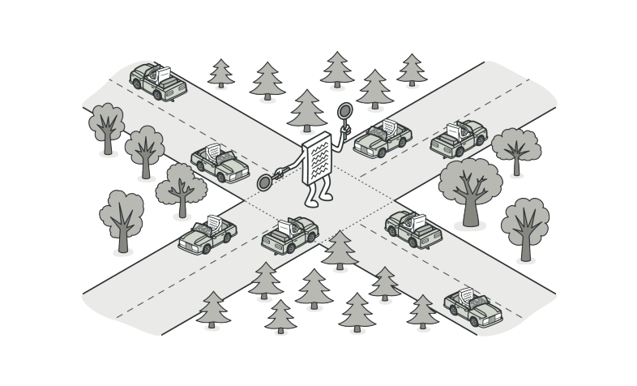
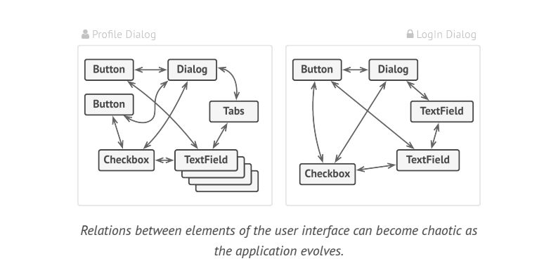
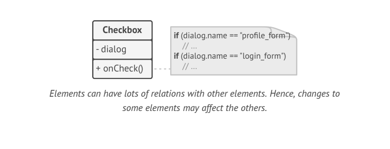
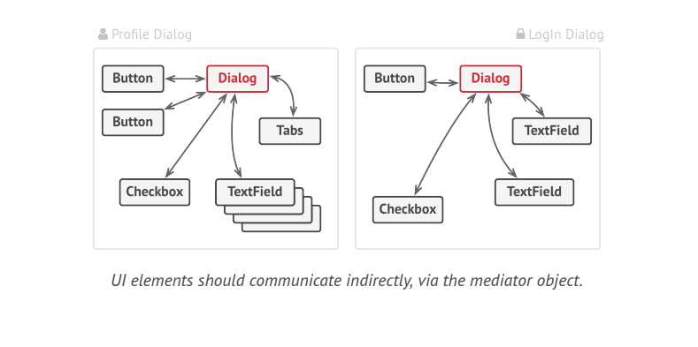
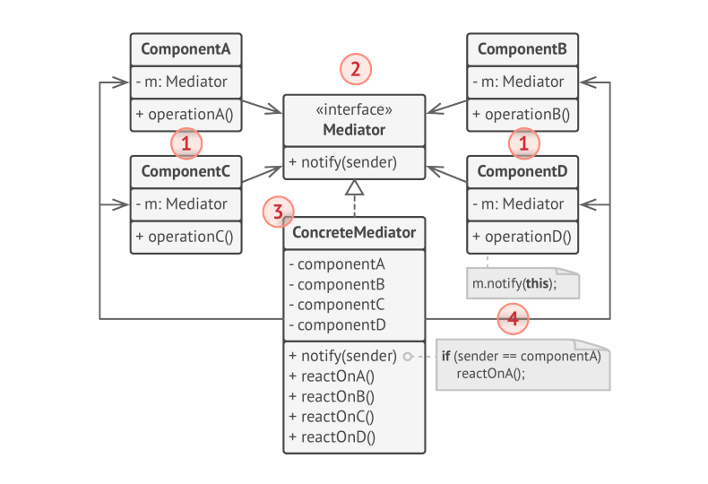

# Mediator

> **Mediator** is a behavioral design pattern that lets you reduce chaotic dependencies between objects. The pattern restricts direct communications between the objects and forces them to collaborate only via mediator object.

### Problem

Say you have a dialog for creating and editing customer profiles. It consists of various controls such as text fields, checkboxes, buttons etc.,

Some form elements may interact with each other. For instance, selecting the "I have a dog" checkbox may reveal a hidden text field for entering the dog's name. Another example is the submit button that has to validate values of all fields before saving the data.

By having this logic implemented directly inside the code fo the form elements you make this element's  classes much harder to reuse in other forms of the app.

### Solution
The **Mediator** pattern suggests that you should cease all direct communication between the components which you want to make independent of each other. Instead, these components must collaborate indirectly by calling a special mediator object that redirects the calls to appropriate components. As a result, the components depend only on a single mediator class instead of being coupled to dozens of their colleagues.

The dialog class acts as the mediator. Most likely the dialog class is aware of all its sub elements. So you won't even need tom introduce new dependencies into this class.

Consider the Submit button. Previously each time a user clicked the button, it had to validate the values of all individual form elements. Now its single job is to notify the dialog about the click. Upon receiving the notification, the dialog itself performs the validations or passes the task to the individual elements. Thus, instead of being tied to a dozen form elements, the button is only dependent on the dialog class.

### Structure

* **Components** are various classes that contain some business logic. Each component has a reference to mediator, declared with the type of mediator interface. The component is not aware of the actual class of the mediator, so you can reuse the component in other programs by linking it to a different mediator.

* The **Mediator** interface declares methods of communication with components, which usually include just a single notification method. Components may pass any context as arguments to this method, including their own objects, but only in such a way that no coupling occurs between a receiving component and the sender's class.

* **Concrete Mediators** encapsulate relations between various components. Concrete mediators often keep references to all components they manage and sometimes even manage their lifecycle.

* Components must not be aware of other components. If something important happens within or to a component, it must only notify mediator. When the mediator receives a notification, it can easily identify sender, which might be just enough to decide what component should be triggered in return.

### Applicability

* Use the Mediator Pattern when it's hard to change some classes because they are tightly coupled to a bunch of other classes.
* Use the Mediator Pattern when you can't reuse a component in a different program because it's too dependent on other components.
* Use the Mediator Pattern when you find yourself creating tons of component subclasses just to reuse some basic behavior in various contexts.
