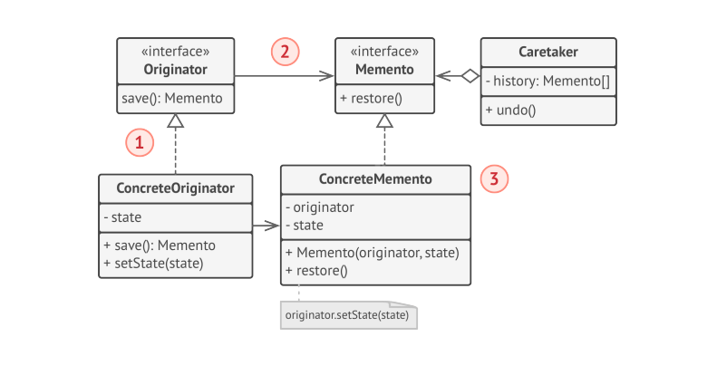

# Memento

> **Memento** is a behavioral design pattern that lets you save and restore the previous state of an Object without revealing the details of its implementation.

### Problem

Imagine that you are creating text editor app. In addition to simple text editing, your editor can format the text, insert inline images etc. At some point you decided to let users undo any operations carried out on the text.
For the implementation, you chose to take direct approach. Before performing any operation, the app records state of all objects and saves it in some storage. Later when a user decides to revert an action, the app fetches the latest snapshot from the history and uses it to restore the state of all objects.

How exactly would you produce one? You would probably need to go over all fields in an object and copy their values into storage. However, this would only work if the object had quite relaxed access restrictions to its contents. Unfortunately, most real objects won't let others peek inside them that easily, hiding all significant data in private fields.

Let's consider the actual "snapshots" of th editor's state. What data does it contain? At a bare minimum, it must contain actual text, cursor coordinate, current scroll position etc. To make a snapshot, you would need to collect these values and put them into some kind of container.

Most likely, you are going to store lots of these container objects inside some list that would represent the history. Therefore, the containers would probably end up being objects of one class. The class would have almost no methods, but lots of fields that mirror the editor's state. To allow other objects to write and read data to and from a snapshot, you would probably need to make its fields public. That would expose all the editors states, private or not.

It looks like we reached dead end: you either expose all internal details of classes, making them too fragile or restrict access to state, making it impossible to produce snapshots.

### Solution

All problems that we have just experienced are caused by broken encapsulation. Some Objects try to do more than they are supposed to. To collect the data required to perform some action, they invade the private space of other objects instead of letting these objects perform the actual action.

The **Memento** pattern delegates creating state snapshots to the actual owner of that state, the _originator_ object. Hence instead of other objects trying to copy the editor's state from the "outside", the editor class itself can make the snapshot since it has full access to its own state.

The pattern suggests storing the copy of the object's state in a special object called _memento_. The contents of memento are not accessible to any other object except the one that produced it. Other objects must communicate with mementos using a limited interface which may allow fetching the snapshot's metadata(creation time, the name of the performed operation etc.), but not the original object's state contained in the snapshot.

Such restrictive policy lets you store mementos inside other objects, usually called _caretakers_. Since the caretaker works with memento only via limited interface, it's not able to tamper with the state stored inside the memento. At the same time, the originator has access to all fields inside the memento, allowing it to restore it's previous state at will.

In our text editor example, we can create a separate history class to act as the caretaker. A stack of mementos stored inside caretaker  will grow each time the editor is about to execute an operation. You could even render this stack within the app's UI, displaying the history of previously performed operations to a user.

When a user triggers undo, the history grabs the most recent memento form the stack and passes it back to the editor, requesting a roll-back. Since editor has full access to memento, it changes its own state with the values taken from memento.

### Structure

**Implementation based on nested classes**

Nested classes available in many popular programming languages like C++, C# and Java.

1. The **Originator** class can produce snapshots of its own state, as well as restore its state from snapshots when needed. 
2. The **Memento** is a value object that acts as a snapshot of the originator's state. It's a common practice to make the memento immutable and pass it the data only once, via constructor.
3. The **Caretaker** knows not only "when" and "why" to capture the originator's state, but also when the state should be restored. The Caretaker can keep track of originator's history by storing a stack of mementos. When originator has to travel back in the history, the caretaker fetches the top most memento from the stack and passes it to the originator's restoration method.

> In this implementation, the memento class is nested inside the originator. This lets originator access the fields and methods of the memento, even though they are declared private. On the other hand the caretaker has very limited access to the mementos fields and methods, which lets it store mementos in a stack but not tamper with their state.

**Implementation based on an intermediate interface**

This implementation is suitable for programming languages that don't support nested classes like _PHP_.

1. In the absence of nested classes, you can restrict access to the memento's fields by establishing a convention that caretakers can work with a memento only through an explicitly declared intermediary interface, which would only declare methods related to the memento's metadata.
2. On the other hand, originators can work with a memento object directly, accessing fields and methods declared in the memento class. The downside of this approach is that you need to declare all members of the memento public.

**Implementation with even stricter encapsulation**

1. This implementation allows having multiple types of originators and mementos. Each originator works with a corresponding memento class. Neither originators nor mementos expose their state to anyone.
2. Caretakers are now explicitly restricted from changing the state stored in mementos. Moreover, the caretaker class becomes independent of the originator because the restoration method is now defined in the memento class.
3. Each memento becomes linked to the originator that produced it. The originator passes itself to the memento's constructor, along with values of its state. A memnto can restore the state of its originator.

### Applicability
* Use the Memento pattern when you want to produce snapshots of the object's state to be able to restore a previous state of the object.
* Use the Memento pattern when direct access to the object's fields/getters/setters violates its encapsulation.
