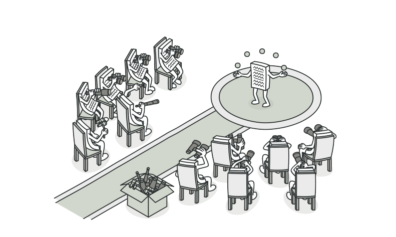
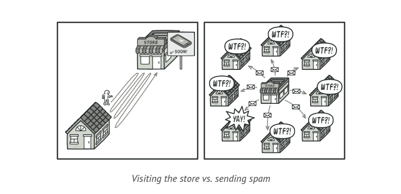
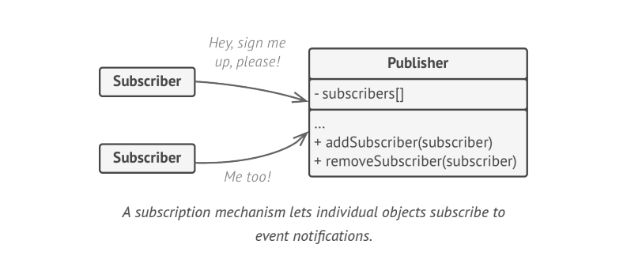
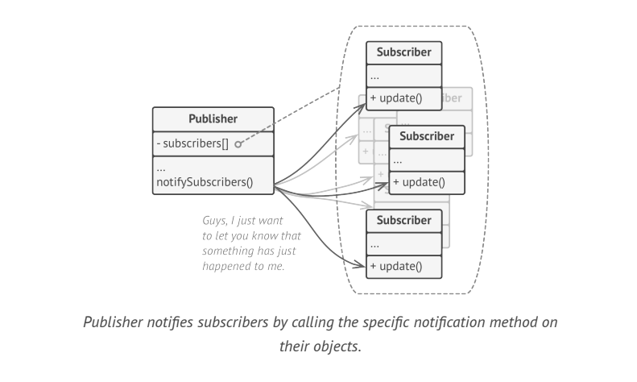
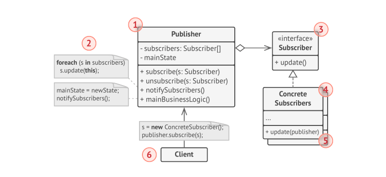

# Observer

> **Observer** is a behavioral design pattern that lets you define a subscription mechanism to notify multiple objects about any events that happen to the object they're observing.

### Problem

Imagine that you have 2 types of Objects: a **Customer** and a **Store**. The customer is very interested ina  particular brand of product which should become available in the store very soon.

The customer could visit the store every day and check product availability. But while the product is still en route, most of these trips would be pointless.

On the other hand, the store could send tons of emails to all customers each time a new product becomes available. This would save some customers from endless trips to the store. At the same time, it would upset other customers who are not interested in new products. It looks like we got a conflict. Either the customer wastes the time checking product availability or the store wastes resources notifying the wrong customers.

### Solution

The Object that has some interesting state if often called _subject_, but since it is also going to notify other objects about changes to its state, we call it _publisher_. All other objects that want to track changes to the _publishers_ state are called _subscribers_.

The **Observer** pattern suggests that you add a subscription mechanism to the publisher class so individual objects can subscribe to or unsubscribe from a stream of events coming from the publisher. This mechanism consists of:
1. An array field for storing a list of references to subscriber objects
2. Several public methods which allow adding subscribers to and removing them from the list.

Now whenever an important event happens to the publisher, it goes over its subscribers and calls the specific notification method on their Objects.

Its crucial that all subscribers implement same interface and that the publisher communicates with them only via that interface. This interface should declare the notification method along with set of parameters that the publisher can use to pass some contextual data along with notification. 

If your app has several types of publishers, and you want to make your subscribers compatible with all of them, you can go even further and make all publishers follow the same interface. The interface would allow subscribers to observe publishers states  without coupling to their concrete classes.

### Structure

* The **Publisher** issues events of interest to other objects. These events occur when the publisher changes its state or executes some behaviors. Publishers contain a subscription infrastructure that lets new subscribers join and current subscribers leave the list. When a new events happen, the publisher goes over the subscription list and calls the notification method declared in the subscriber interface on each subscriber object.
* The **Subscriber** Interface declares the notification interface. In most cases, it consists of single _update_ method. The method may have several parameters that let the publisher pass some event details along with the update.
* **Concrete Subscribers** perform some actions in response to notifications issued by the publisher. All of these classes should implement the same interface so the publisher is not coupled to concrete classes.

> Usually Subscribers need some contextual information to handle the update correctly. For this reason, publishers often pass some context data as arguments of the notification method. The publisher can pass itself as an argument, letting subscriber fetch any required data directly.

### Applicability
* Use the Observer pattern when changes to state of one object may require changing other objects and actual set of objects are unknown beforehand or changes dynamically.
* Use the Observer pattern when some objects in your app must observe others, but only for limited time or in specific cases.
