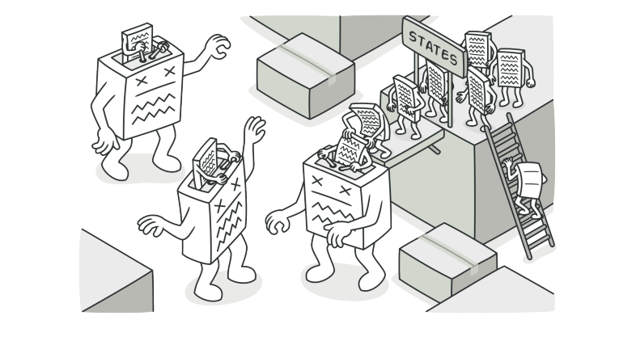
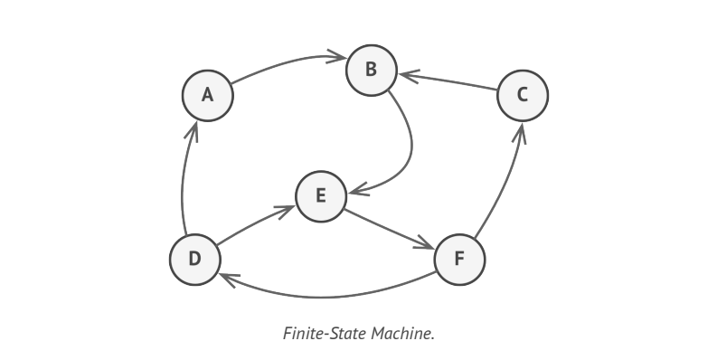

# State



> **State** is a behavioural design pattern that lets an object alter its behavior when its internal state changes. It appears as if the object changed its class.

### Problem
The State pattern closely related to the concept of a **Finite-State Machine**.



The main idea is that, at any given moment, there's a finite number of _states_ which a program can be in. Within any unique state, the program behaves differently, and the program can be switched from one _state_ to another instantaneously. However, depending on current state, the program may or may not switch to certain other states. These switching rules, called _transitions_ , are also finite and predetermined.

You can also apply this approach to Objects. Imagine that we have a _Document_ class. A document can be in one of three states: _Draft, Moderation and Published_. The _publish_ method of Document works a little differently in each state.

* In _Draft_, it moves the document o moderation.
* In _Moderation_, it makes the document public, but only if the current user is an administrator.
* In _Published_, it doesn't do anything at all.


State Machines are usually implemented with lots of conditional operators(if, switch) that selects the appropriate behavior depending on the current state of the Object.

```php
class Document {
public string state;
// ...
    public method publish() {
        switch (state) {
            "draft":
            state = "moderation";
            break;
            "moderation":
             if (currentUser.role == 'admin')
             state = "published"
             break;
             "published":
             // Do nothing.
         }
    }
     // ...
}
```

The biggest weakness of state machine based on conditionals reveals itself once we start adding more and more states and state-dependent behaviors to the _Document_ class. Most methods contains monstrous conditionals that pick the proper behavior of the method according to current state. Code like this is very difficult to maintain because any change to transition logic may require changing state conditionals in every method. A lean state machine built with a limited set of conditionals can grow into bloated mess overtime.

### Solution

The State Pattern suggests that you create new classes for all possible states of an object and extract all state-specific behaviors into these classes.

Instead of implementing all behaviors on its own, the original object called context, stores a reference to one of the state objects that represents its current state, and delegates all state related work to that Object.


To transition the context into another state, replace the active state object with another object that represents that current state. This is possible only if all state classes follow the same interface and the context itself works with these objects through that interface.

> This structure may look similar to the **Strategy** pattern, but there's one key difference. In the State pattern, the particular states may be aware of each other and initiate transitions from one state to another, whereas strategies almost never know about each other.

### Structure


1. **Context** stores a reference to one of the concrete state objects and delegates to it all state-specific work. The context communicates with the state object via state interface. The context exposes a setter for passing it a new state object.
2. The **State** interface declares the state-specific methods. These methods should make sense for all concrete states because you don't want some of your states to have useless methods that will never be called.
3. **Concrete States** provide their own implementations for the state-specific methods. To avoid duplication of similar code across multiple states, you may provide intermediate abstract classes that encapsulate some common behavior.

> State Objects may store a back reference to the context object. Through this reference, the state can fetch any required info from the context object, as well as initiate state transitions.

4. Both context and concrete states can set the next state of the context and perform the actual state transition by replacing the state object linked to the context.

### Applicability

* Use State pattern when you have an object that behaves differently depending on its current state, the number of states is enormous, and state specific code changes frequently.
* Use State pattern when you have a class polluted with massive conditionals that alter how the class behaves according to the current values of the class's fields.
* Use State pattern when you have a lot of duplicate code across similar states and transitions of a condition-based state machine.
