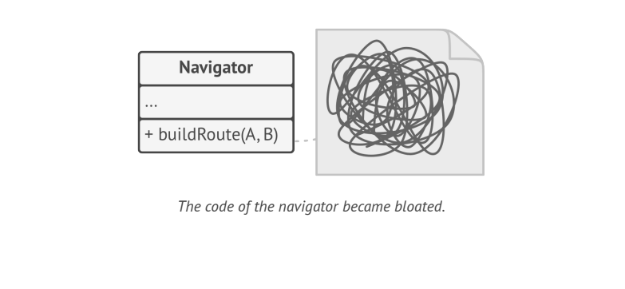
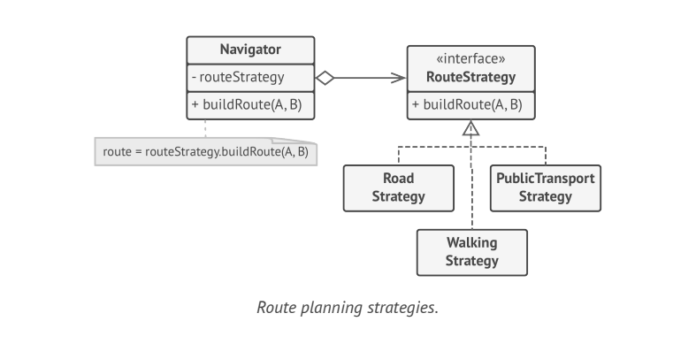
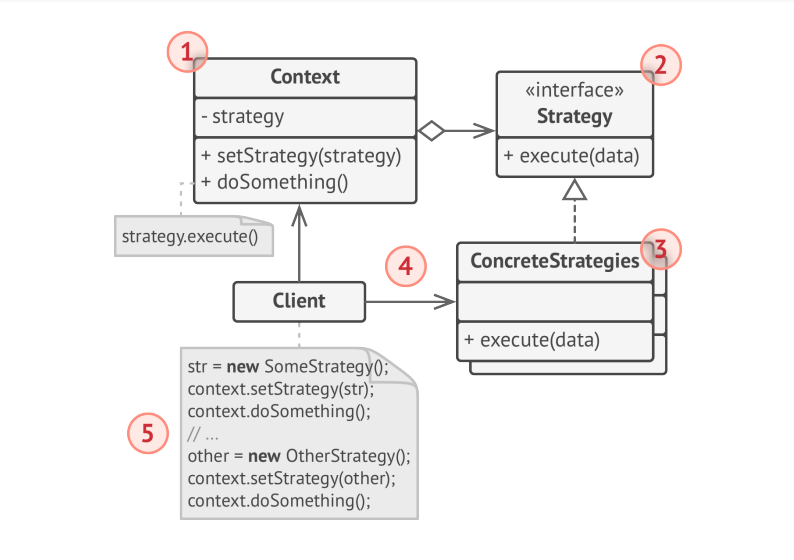

# Strategy

> **Strategy** is a behavioral design pattern that lets you define a family of algorithms, put each of them into separate class and make their objects interchangeable.

### Problem
One day you decided to create a navigation app for casual travelers. The app is centered around a beautiful map which helped users quickly orient themselves in any city.

One of the most requested features for the app was automatic route planning. A user should be able to enter an address and able to see the fastest route to the destination displayed on the map.

The first version of app could only build routes over roads. People who travelled by car were bursting with joy. But apparently not everybody likes to drive on their vacation. So with next update, you added an option to build walking routes. Right after that, you added other option to let people use public transport in their routes. Later you planned to add routes for cyclists. And even later, another option for building routes through all of a city's attractions.

Each time you added a new routing algorithm, the main class of navigator doubled in size. At some point, the beast became too hard to maintain.

### Solution
The **Strategy** pattern suggests that you take a class that does something specific in a lot of different ways and extract all of these algorithms into separate classes called _strategies_.

The original class, called _context_, must have a field for storing a reference to one of the strategies. The context delegates the work to a linked strategy object instead of executing ot on its own.

The context is not responsible for selecting an appropriate algorithm for the job. Instead, the client passes the desired strategy to teh context. It works with all strategies through the same generic interface, which only exposes a single method for triggering the algorithm encapsulated within a selected strategy.

In our navigation app, each routing algorithm can be extracted to its own class with a single _buildRoute_ method. The method accepts an origin and destination and returns a collection of route's checkpoints.

Even though given the same arguments, each routing class might build a different route, the main navigation class doesn't really care which algorithm is selected since its primary job is to render a set of checkpoints on the map.

### Structure

1. The **Context** maintains a reference to one of the concrete strategies and communicates with this object only via strategy interface.
2. The **Strategy** interface is common to all concrete strategies. It declares a method the context uses to execute a strategy.
3. **Concrete Strategies** implement different variations of an algorithm the context uses.

> The Context calls the execution method on the linked strategy object each time it needed to run the algorithm. The context doesn't know what type of strategy it works with or how the algorithm is executed.

5. The **Client** creates a specific strategy object and passes it to the context. The context exposes a setter which lets clients replace a strategy associated with the context at runtime.

### Applicability
* Use a Strategy pattern when you want to use different variations of an algorithm within an object and able to switch from one algorithm to another during runtime.
* Use a Strategy pattern when you have a lot of similar classes that only differ in the way they execute some behavior.
* Use a Strategy pattern to isolate the business logic of a class from the implementation details of algorithms that may not be as important in the context of that logic.
* Use a Strategy pattern when your class has massive conditional operator that switches between different variants of same algorithm.
