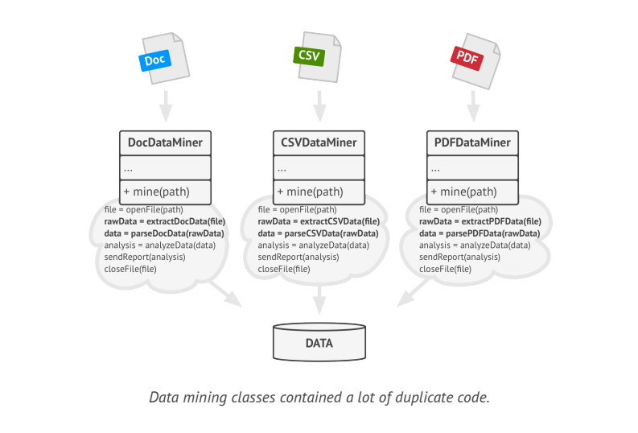
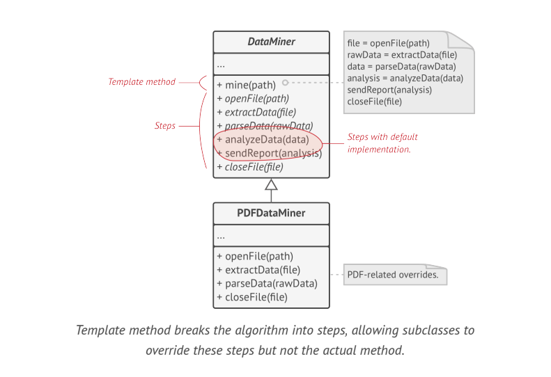
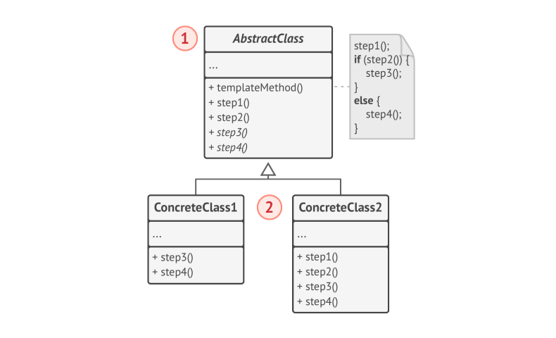

# Template Method

> **Template Method** is a behavioral design pattern that defines a skeleton of an algorithm in the superclass but lets subclasses override specific steps of the algorithm without changing its structure.

### Problem

Imagine that you are creating a data mining application that analyses corporate documents. Users feed app documents in various formats(PDF, DOC, CSV), and it tries to extract meaningful data from these docs in a uniform format.

The first version of app could work only with DOC files. In the following version, it was able to support CSV files. A month later, you added support for PDF files.

At some point you noticed that all three classes have a lot of similar code. While the code for dealing with various data formats was entirely different in all classes, the code for data processing and analysis is almost identical. Wouldn't it be great to get rid of code duplication, leaving the algorithm structure intact?

### Solution

The **Template Method** pattern suggests that you break down an algorithm in to series of steps, turn these steps into methods, and put a series of calls to these methods inside a single "template method". The steps may either be abstract, or have some default implementation . To use the algorithm, the client is supposed to provide its own subclass, implement all abstract steps  and override some optional ones if needed.

We can create a base class for all three parsing algorithms. This class defines a template method consisting of series of calls to various document-processing steps. 

At first, we can declare all steps _abstract_, forcing subclasses to provide their own implementations for these methods. In our case, subclasses already have all necessary implementations, so only thing we might need to do is adjust signatures of methods to match the methods of super class.

It looks like the code for opening/closing files and extracting/parsing data is different for various data formats, so there is no point in touching those methods. However, implementation of other steps, such as analysing the raw data and composing reports is very similar, so it can be pulled up in to base class, where subclasses can share that code.

We got 2 types of steps:
1. Abstract steps must be implemented by every subclass.
2. Optional steps already have some default implementation, but still can be overridden if needed.

> There is another kind of step, called _hooks_. A hook is an optional step with an empty body. A template method would work even if a hook is not overridden. Usually hooks are placed before and after crucial steps of algorithms, providing subclasses with additional extension points for an algorithm.

### Structure

1. The **Abstract Class** declares methods that act as steps of an algorithm, as wells as the actual template method which calls these methods in a specific order. The steps may either be declared _abstract_ or have some default implementation.
2. **Concrete Classes** can override all the steps, but not template method itself.

### Applicability
* Use the Template Method pattern when you want to let clients extend only particular steps of an algorithm, but not whole algorithm or its structure.
* Use the Template Method pattern when you have several classes that contains almost identical algorithms with some minor differences. As a result, you might need to modify both classes when algorithm changes.

