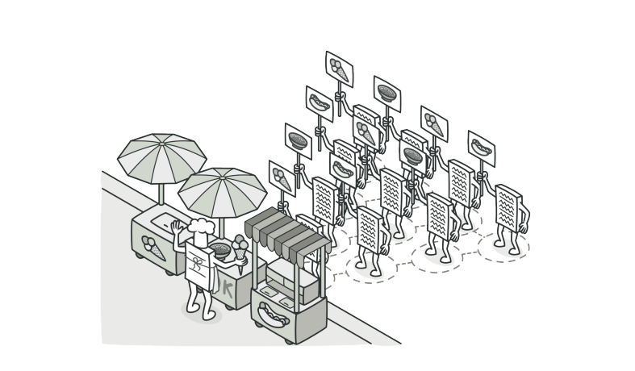
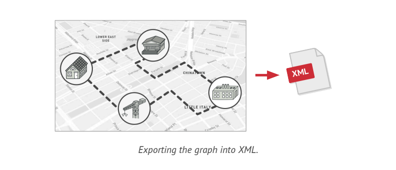
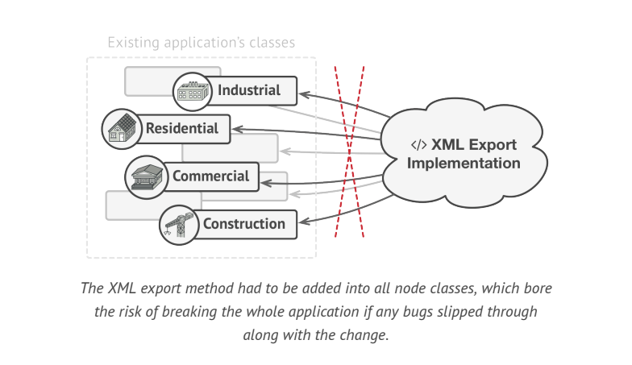
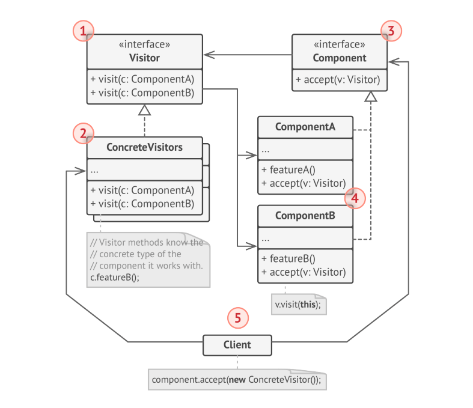

# Visitor



> **Visitor** is a behavioral design pattern that lets you separate algorithms from the Objects on which they operate.

### Problem

Imagine that your team develops an app which works with geographic information structured as one colossal graph. Each node of a graph may represent a complex entity such as a city and granular things like industries, sightseeing areas etc. The nodes are connected with others if there is a road between real objects that they represent. Under the hood each node type is represented by its own class, while each specific node is an Object.



At some point, you got task to implement exporting the graph into XML format. At first, the job seemed pretty straight forward. You planned to add an export method to each node class and leverage recursion to go over each node of the graph, executing the export method. The solution was simple & elegant: thanks for polymorphism, you are not coupling the code which called the export method to concrete classes of nodes.

Unfortunately, the system architect refused to allow you to alter existing node classes. He said that the code was already in production, and he didn't want ot risk breaking it because of a potential bug in your changes.



Besides, he questioned whether it makes sense to have XML export code with in the node classes. The primary job of these classes was to work with geo data. The XML export behavior would look alien there.

There was another reason for the refusal. It was highly likely that after this feature was implemented, someone from the marketing department would ask you to provide the ability to export into a different format, or request some other weird stuff.

### Solution

The **Visitor** pattern suggests that you place new behavior into separate class called _visitor_, instead of trying to integrate it into existing classes. The original object that had to perform the behavior now is passed to one of teh visitor's methods as an argument, providing the method access to all necessary data contained with in the Object.

In our case with XML export, the actual implementation will probably be a little different across various node classes. Thus, the visitor class may define not one, but a set of methods, each of which could take arguments of different types like this:

```php
class ExportVisitor implements Visitor {
    public function doForCity(City c) { ... }
    public function doForIndustry(Industry f) { ... }
    public function doForSightSeeing(SightSeeing ss) { ... }
    // ...
}
```

But how exactly would we call these methods, especially when dealing with the whole graph? These methods have different signatures, so we can't use polymorphism. To pick the proper visitor method that's able to process a given Object, we need to check its class. Doesn't this sound like a nightmare?

```php
foreach (Node node in graph)
    if (node instanceof City){
        exportVisitor.doForCity((City) node);
    }
    
    if (node instanceof Industry){
        exportVisitor.doForIndustry((Industry) node);
    }
    // ...
}
```

The **Visitor** pattern addressed this problem. It uses technique called **Double Dispatch**, which helps to execute the proper method on an object without cumbersome conditionals. Instead of letting the client select a proper version of the method to call, how about we delegate this choice to Objects we are passing to the visitor as an argument?

Since the Objects know their own classes, they will be able to pick a proper method on the visitor less awkwardly. They "accept" a visitor and tell it what visiting method should be executed.

```php
// Client code
foreach (Node node in graph)
node.accept(exportVisitor)

// City
class City {
    public function accept(Visitor v) {
        v.doForCity(this);
        // ...
    }
}


// Industry
class Industry {
    public function accept(Visitor v) {
        v.doForIndustry(this);
    }
}

// ...
```

Now, if we extract common interface for all visitors, all existing nodes can work with any visitor you introduce into the app. If you find yourself introducing a new behavior related to nodes, all you have to do is implement a new visitor class.

### Structure



1. A **Visitor** interface declares a set of visiting methods that can take concrete components as arguments. These methods may have the same names if the program is written in a language that supports overloading, but the type of their parameters must be different.
2. Each **Concrete Visitor** implements several versions of the same behaviors, tailored for different concrete component classes.
3. The **Component** Interface declares a method for accepting visitors. This method should have one parameter declared with the type of the visitor interface.
4. Each **Concrete Component** must implement the acceptance method. The purpose of this method is to redirect the call to proper visitor's method corresponding to the current component class. Be aware that even if a base component class implements this method, all subclasses must still override his method in their own classes and call the appropriate method on the visitor Object.
5. The **Client** usually represents a collection or some other complex Object. Usually, clients are not aware of all the concrete component classes because they work with Objects from that collection via some abstract interface.

### Applicability

* Use the Visitor when you need to perform an operation on all elements of a complex Object structure.
* Use the Visitor to clean up the business logic of auxiliary behaviors
* Use the Visitor when a behavior makes sense only in some classes of class hierarchy, but not in others.
