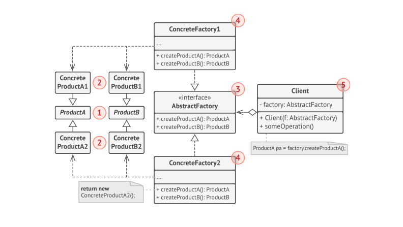

# Abstract Factory

> **Abstract Factory** is a Creational Design pattern that lets you produce families of related Objects without Specifying the concrete Classes.

* The Client Code has to work with both factories and products via their respective abstract interfaces. This lets you change the type of factory that you pass to the client code, as well as the product variant that the client code receives, without breaking the actual client code.
* If the client is only exposed to the abstract interfaces, **what creates the actual factory Objects?** Usually application creates a concrete factory object at the initialization stage. Just before that, the app must select the factory type depending on the configuration or environment settings.

### Structure

1. **Abstract products** declare Interfaces for a set of distinct but related products which make up a product family.
2. **Concrete Products** are various implementations of abstract products, grouped by variants. Each abstract product(car/chair/sofa) must be implemented in all given variants(Ikea, Modern).
3. The **Abstract factory** interface declares a set of methods for creating each of the abstract products.
4. **Concrete Factories** implement creation methods of the abstract factory. Each concrete factory corresponds to a specific variant of products and creates only those product variants. The Client can work with any concrete factory/product variant, as long as it communicates with their Objects via abstract interfaces.

### Applicability

* Use Abstract Factory when your code needs to work with various families of related products, but you don't want it to depend on the concrete classes of those products - they might be unknown beforehand, or you simply want to allow future extensibility.
