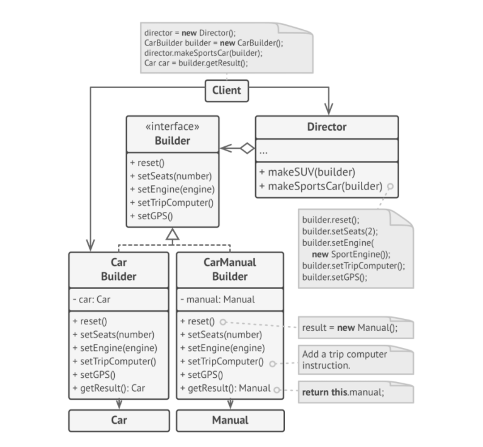

# Builder


> **Builder** is a Creational Design Pattern that lets you construct complex objects' step by step. This Pattern allows you to produce different types and representations of an Object using the same construction code.

The **Director** class defines the order in which to execute the building steps, while the builder provides the implementation for those steps. Having Director class in your program is not strictly necessary. You can always call building steps in a specific order directly from the client code. However, the director class might be a good place to put various construction routines so you can reuse them across your program.

### Problem
Imagine a complex object that requires laborious, step-by-step initialization of many fields and nested Objects. Such initialization code is usually buried inside a monstrous constructor with lost of parameters. Or even worse: scattered all over the client code.

### Solution
The builder pattern suggests that you extract the object construction code out of its own class and move it to separate objects called _builders_.

### Structure


1. The **Builder** interface declares product construction steps that are common to all builders.
2. **Concrete Builders** provide different implementations of the construction steps. Concrete builders may produce products that don't follow the common interface.
3. **Products** are resulting Objects. Products constructed by different builders don't have to belong to the same class hierarchy or interface.
4. The **Director** class defines the order in which to call construction steps, so you can create and reuse specific configurations of products.
5. The **Client** must associate one of the builder objects with the director.  Usually it is done once, via parameters of the director's constructor. Then the director uses that builder object for all further construction. There is an alternative approach for when client passes the buildr Object to the production method of the director. In this case, you can use a different builder each time you produce something with the director.



### Applicability

* Use Builder pattern to get rid of a **"telescopic constructor"**.
```php
class Pizza { ... }
Pizza(int size) { ... }
Pizza(int size, boolean cheese) { ... }
Pizza(int size, boolean cheese, boolean pepperoni) { ... }
```

* Use the Builder Pattern when we want your code to be able to create different representations of some product.
* Use Builder to construct Composite Tress or other complex Objects.
    
