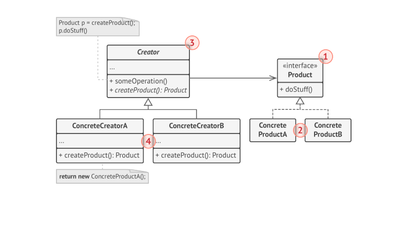

# Factory Method

> **Factory Method** is a creational design pattern that provides an interface for creating objects in a super class, but allows subclasses to alter the type of objects that will be created.

* Objects returned by a factory Method are often referred as **Products**
* SubClasses may return different types of products only if these products have a common base class or interface.
* Factory method in the vase class should have its return type declared as interface.
* The Code that uses the factory method(often called as client code) doesn't see difference between the actual products returned by various subclasses.

### Structure

1. The **Product** declares the interface, which is common to all objects that can be produced by the creator and its subclasses.
2. **Concrete Products** are different implementations for Product Interface.
3. The **Creator** classes declares the factory method(abstract or default product type) that returns new product Objects. It's important that return type of this method matches the product Interface.
4. **Concrete Creators** override the base factory method so it returns a different type of Product.

> **NOTE**: Factory Method doesn't have to create new instances all the time. It can also return existing Objects from a cache, an Object Pool, or another Source.

### Applicability

* Use the Factory Method when you don't know beforehand the exact types and dependencies of the Objects your code should work with.
* Use the Factory Method when you want to provide users of your library or framework with a way to extend its internal components.
* Use the Factory Method when you want to save system resources by reusing existing Objects instead of rebuilding then each time.
