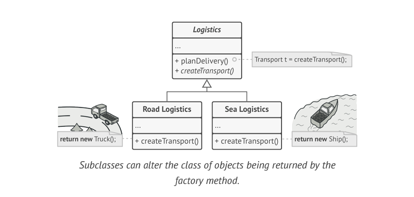

# Factory Method

> Provides an interface for creating Objects in a Super Class, but allows subclasses to alter the type of Objects that will be created. 

### Problem

Imagine that you’re creating a logistics management application. The first version of your app can only handle transportation by trucks, so the bulk of your code lives inside the **Truck** class.

After a while, your app becomes pretty popular. Each day you receive dozens of requests from sea transportation companies to incorporate sea logistics  into the app.

At present, most of your code is coupled to the **Truck** class. Adding **Ships** into the app would require making changes to the entire codebase. Moreover, if later you decide to add another type of transportation to the app, you will probably need to make all of these changes again.

### Solution
The Factory Method pattern suggests that you replace direct object construction calls (using the new operator) with calls to a special factory method. Don’t worry, the objects are still created via the new operator, but it’s being called from within the factory method. Objects returned by a factory method are often referred to as “products.

The code that uses the factory method (often called the client code) doesn’t see a difference between the actual products returned by various subclasses. The client treats all the products as abstract Transport .

### Applicability

* Use the Factory Method when you don’t know beforehand the exact types and dependencies of the objects your code should work with.
* Use the Factory Method when you want to provide users of your library or framework with a way to extend its internal components.
* Use the Factory Method when you want to save system resources by reusing existing objects instead of rebuilding them each time.
