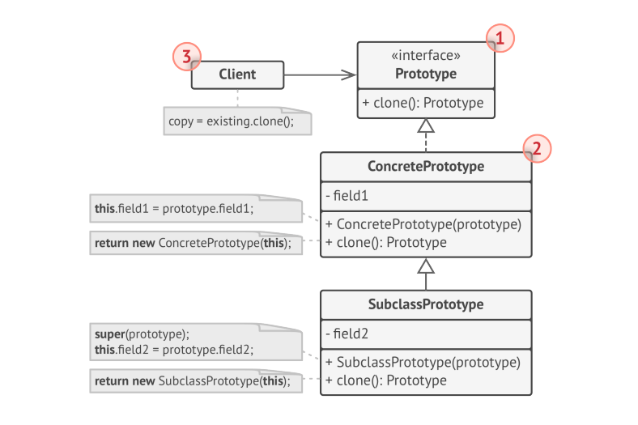

# Prototype

> **Prototype** is  a creational Design pattern that lets you copy existing objects without making your code dependent on their classes. Also known as **Clone**.

### Problem
Say you have an Object, and you want to create an exact copy of it. How would you do it? First, you have to create a  new object of same class. Then you have to go through all fields of the original Object and copy their values over to the new Object.

Nice! But there is a catch. Not all Objects are copied that way because some of Object's fields may be private and not visible from outside of the object itself.

### Solution
The Prototype Pattern delegates the cloning process to the actual objects that are being cloned. The pattern declares a common interface for all objects that support cloning. This interface lets you clone an object without coupling your code to the class of that Object. Usually, such an interface contains s single _clone_ method.

An Object that supports cloning is called **_Prototype_**.

### Structure
**Basic Implementation**

1. The **Prototype interface** declares the cloning methods. In most cases, it's single _clone_ method.
2. The **Concrete Prototype** class implements teh cloning method. In addition to copying original object's data to the clone, this method may also handle some edge cases of the cloning process related to cloning linked objects untangling recursive dependencies etc.,

**Prototype Registry Implementation**

The **Prototype Registry** provides an easy way to access frequently used prototypes. It stores set of pre-built objects that are ready to be copied. The simplest prototype registry is a `name -> prototype` hash map. How ever if you need better search criteria than a simple name, you can build a much more robust version of the registry.

### Applicability

* Use the Prototype Pattern when your code shouldn't depend on the concrete classes of objects that you need to copy.
* Use the Pattern when you want to reduce number of subclasses that only differ in the way they initialize their respective objects. Somebody could have created these subclasses to be able to create objects with specific configuration.
