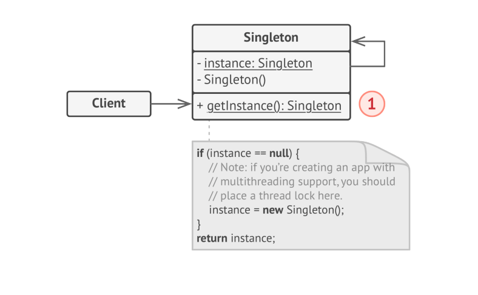

# Singleton

> **Singleton** is a creational design pattern that lets you ensure that a class has only one instance, while providing a global access point to this instance.

### Problem
The Singleton pattern solves 2 problems at the same time, violating the _Single Responsibility Principle_.
1. Ensure that a class has just single instance.
2. Provide global access point to that instance.

### Solution
All implementations of Singleton have these 2 steps in common:
* Make default constructor private, to prevent other objects from using the `new` operator with Singleton class.
* Create static creation method that acts as a constructor. Under the hood, this method calls the private constructor to create an object  and saves it in a static field. All the following calls to this method return cached object.

If your code has access to the Singleton class, then it is able to call the Singleton's static method. So whenever that method is called, the same object is always returned.

### Structure

The **Singleton** class declares the static method `getInstance` that returns the same instance of its own class.

The Singleton's class constructor should be hidden from the client code. Calling the `getInstance` method should be the only way of getting the Singleton Object.

### Applicability
* Use the Singleton Pattern when a class in your program should have just single instance available to all clients.
* Use Singleton Pattern when you need stricter control over global variables.
