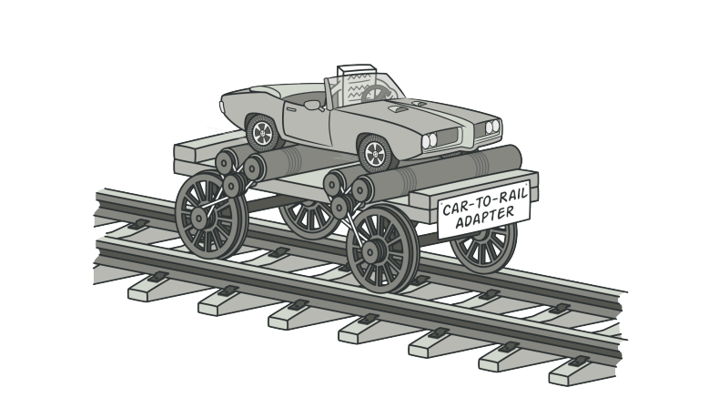
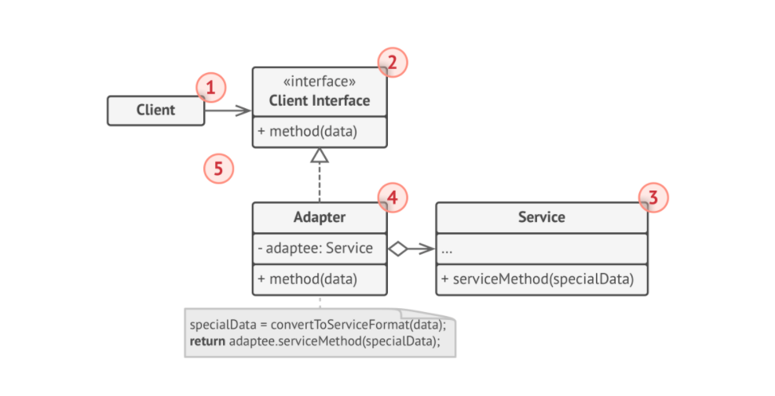
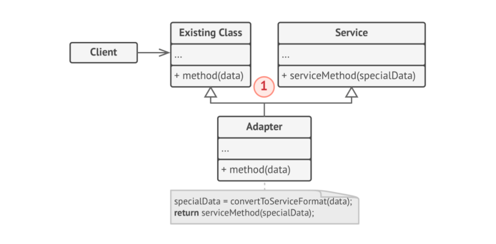

# Adapter

> **Adapter** is a structural design pattern that allows objects with incompatible interfaces to collaborate. Also known as **Wrapper**.

### Problem
Imagine that you are creating a Stock Market monitoring app. The app downloads the stock data from multiple sources in XML format and then displays nice-looking charts and diagrams for the user.

At some point you decide to improve teh app by integrating a smart 3rd-party analytics library. But there is a catchL the analytics library only works with data in JSON format.

### Solution
You can create an **adapter**. This is a special object that converts the interface of one object so that another object can understand it. An adapter wraps one of the objects to hide the complexity of conversation happening behind the scenes.

Adapters can not only convert data into various formats but also help objects with different interfaces collaborate.

### Structure
**Object Adapter**

This implementation uses the composition principle: the adapter implements the interface of one object and wraps the other one. It can be implemented in all programming languages.

1. The **Client** is a class that contains existing business logic of the program.
2. The **Client Interface** describes a protocol that other classes must follow to be able to collaborate with client code.
3. Teh **Service** is some useful class(3rd party). The client can't use this class directly because it has an incompatible interface. 
4. The **Adapter** is a class that is able to work with both client and service. The adapter receives calls from the client via adapter interface and translates them into calls to the wrapped service object in a format it can understand.

**Class Adapter**
This implementation uses inheritance: the adapter inherits interfaces from both Objects st same time. Note that this approach can only implemented in programming languages that supports multiple inheritance.

### Applicability

* Use Adapter class when you want to use some existing class, but its interface ins not compatible with the rest of your code.
* Use Adapter pattern when you want to reuse several existing classes that lack some common functionality that can't be added to the superclass.
