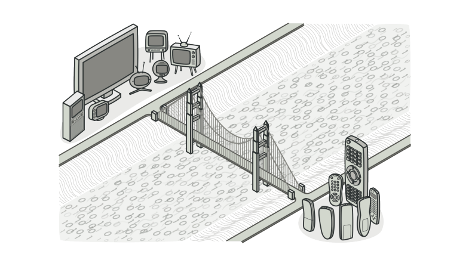
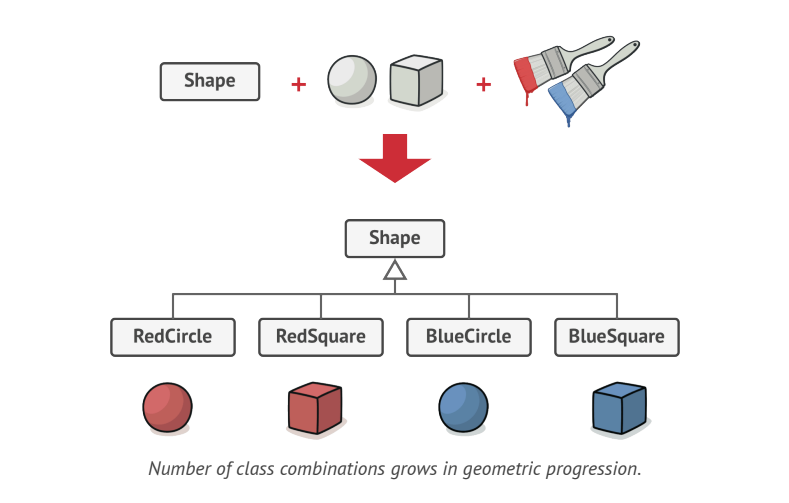
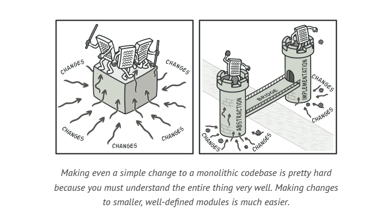
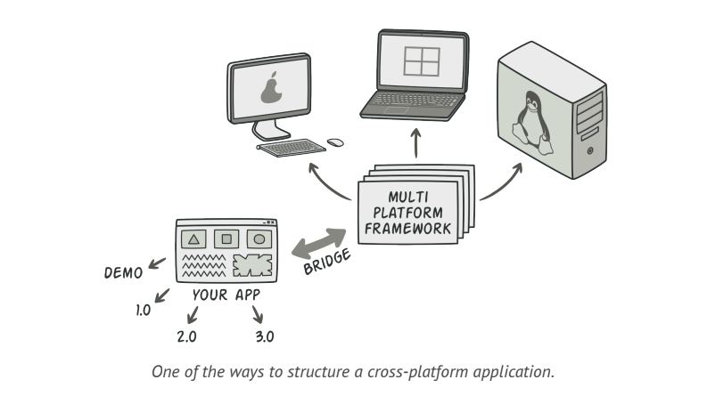
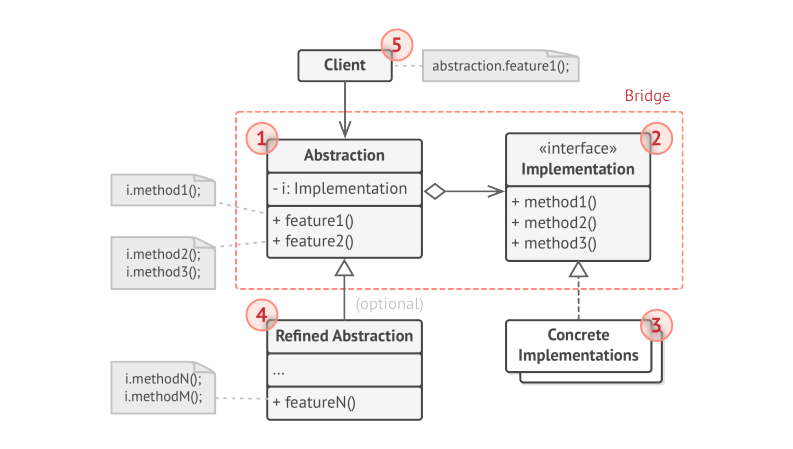
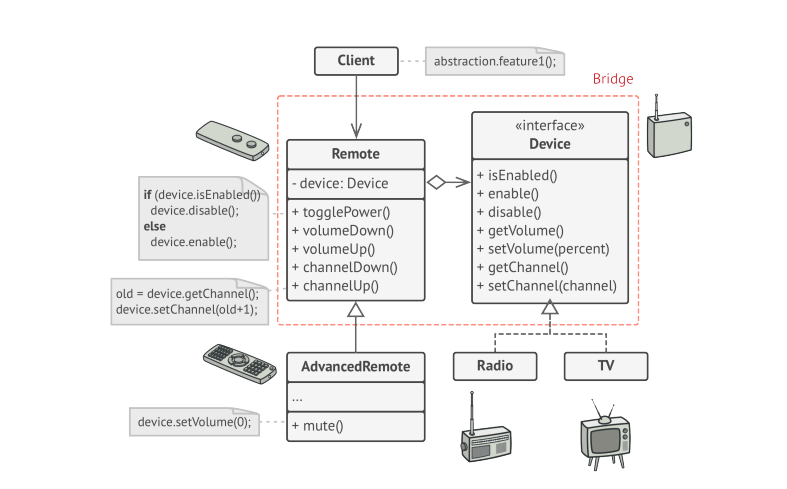

# Bridge

> **Bridge** is a structural design pattern that lets you split a large class or a set od closely related classes into 2 separate hierarchies(_abstraction & implementation_), which can be developed independently of each other.

### Problem
If you have a geometric `Shape` class with a pair of subclasses(Circle & Square). You want to extend this class hierarchy to incorporate colors. So you plan to create `Red` & `Blue` shape subclasses. However, since you already have 2 subclasses, you'll need to create 4 class combinations(`BlueCircle, RedCircle, BlueSquare, RedSquare`).

Adding new shape types and colors to hierarchy will grow it exponentially.

### Solution
This problem occurs because we are trying to extend shape classes in 2 independent directions: by form and by color. This is very common problem with class inheritance.

The **Bridge** pattern solves this problem by switching _inheritance_ to _composition_.  This means we extract one of the dimentions into deparate class hierarchy, so that original class will reference an object of the new hierarchy, instead of having all of its state and behaviors within one class.

**Abstraction & Implementation**
_Abstraction_(_interface_) is a high level control layer for some entity. This layer isn't supposed to do any real work on its own. It should delegate the work to the _implementation_ layer(_platform_). We are not talking about _interfaces and abstract classes_ from programming language.

When talking about real applications, the **abstraction** can be represented by a **GUI** and implementation could be the underlying **OS** code(API) which GUI layer calls in response to user interactions.

We can extend such an app in 2 independent directions:
* Have several GUIs(for customers and admins)
* Support several APIs(Windows, Linux and MacOS)

### Structure

* The **Abstraction** provides high level control logic. It relies on the implementation Object to do actual low level work.
* The **Implementation** declares the interface that's common for all concrete implementations. An abstraction can only communicate with an implementation object via methods that are declared here.
* **Concrete Implementations** contain platform specific code.
* **Refined abstractions** provide variants of control logic. Like their parent, they work with different implementations via the general implementation interface.
* **Client** is only interested in working with abstraction. 

### Applicability
* Use the Bridge pattern when you want to divide and organize a monolithic class that has several variants of some functionality(class can work with several database servers)
* Use the pattern when you need to extend a class in several independent directions.
* Use Bridge if you need to switch implementations at runtime.
