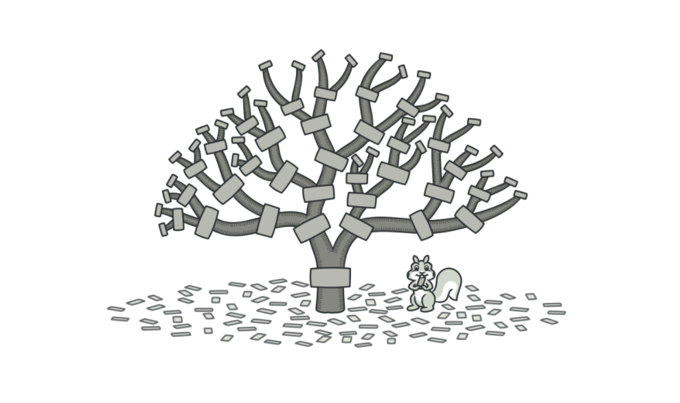
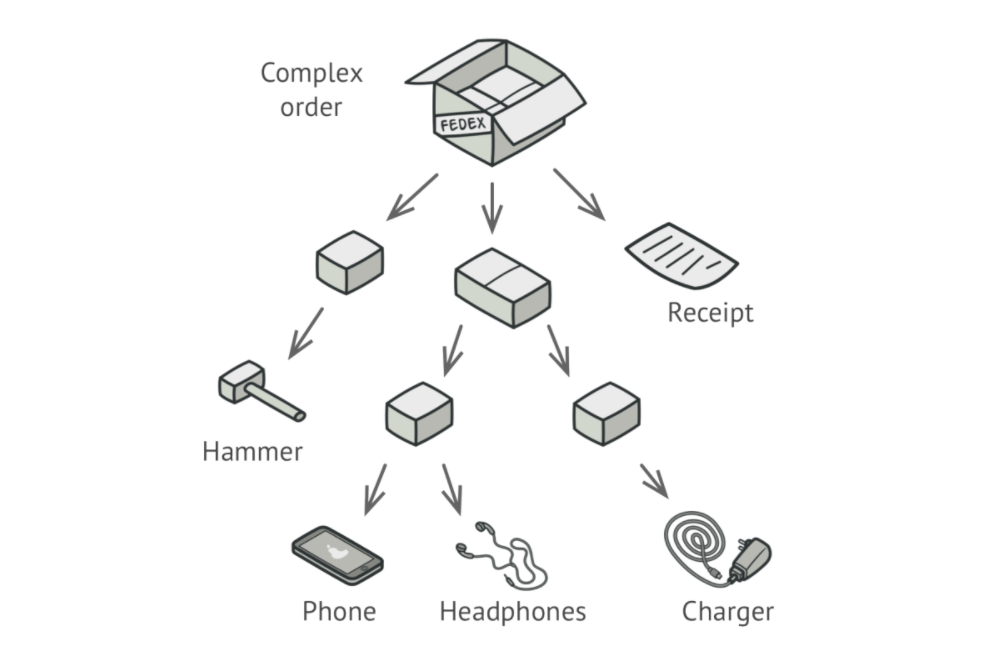
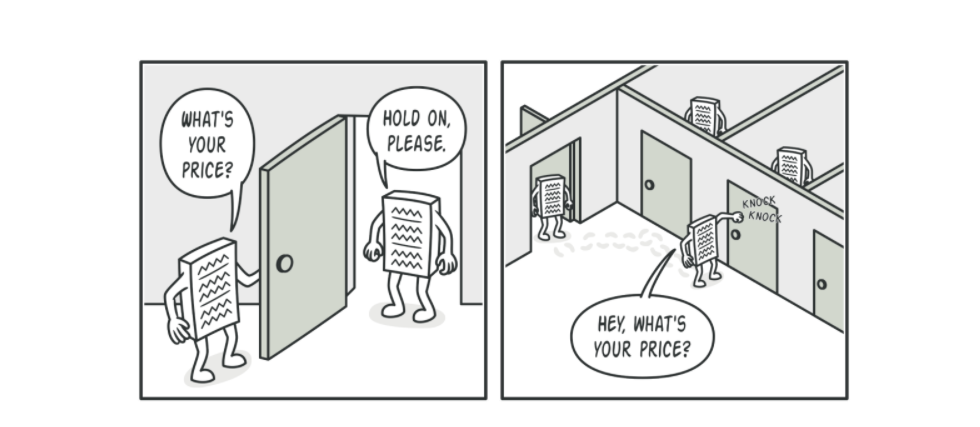
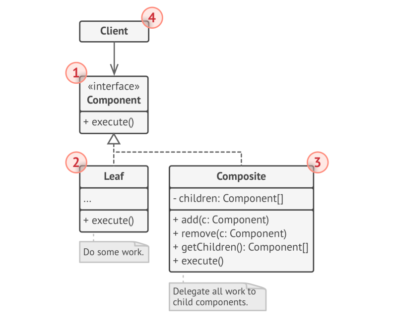

# Composite

> **Composite** is a structural design pattern that lets you compose objects into tree structures and work with these structures as if they are individual Objects.

### Problem
Using Composite Pattern makes sense only when the core model of your app can be represented as a tree.

For Example: Imagine that you have 2 types of Objects: _Products_ & _Boxes_. A _Box_ can contain several _Products_ as well as number of small _boxes_. These little _boxes_ can also hold some _Products_ or even _small boxes_ and so on.

If you decode to create an ordering system that uses these classes. Orders could contain simple products without wrapping as well as boxes stuffed with products and other boxes. How would you determine the total price of such an order?

### Solution
The Composite Pattern Suggests that you work with _Products_ and _Boxes_ through common interface which declares the method for calculating the total price.

For a _Product_, It would simply return the product's price. For a box, it would go over each item in the box, as its price and then return a total for this box. If one of these items were a smaller box, that box would also start going over its contents and so on, until the prices of all inner components were calculated. A box would even add some extra cost to the final price such as packaging cost.

### Structure

1. The **Component** Interface describes operations that are common to both simple and complex elements of the tree.
2. The **Leaf** is a basic element of a tree. It doesn't have any sub elements.
3. The **Container(Composite)** is an element that has sub elements(leaves or other containers). A container doesn't know the concrete classes of its children. It works with sub elements only via component interface. Upon receiving a request, container delegates the work to its sub elements, process intermediate results and then returns the final result to the client. 
4. The **Client** work with all elements through the **Component** Interface. 

### Applicability
* Use the Composite Pattern when you have to implement a tree like Object Structure.
* Use the Pattern when you want client code to treat both simple and complex elements uniformly.
