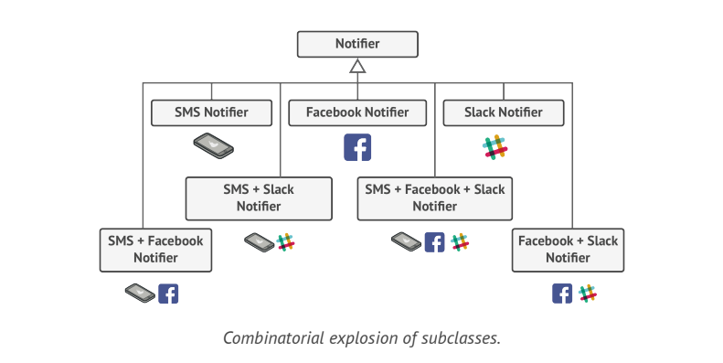

# Decorator

> **Decorator** is a structural Design pattern that lets you attach new behaviors to Objects by placing these Objects inside special wrapper Objects that contain the behaviors.

### Problem
Imagine that you are working on a notification library which lets other programs notify their users about important events.

The initial version of the library is based on the _Notifier_ Class and had only few fields, a constructor and a single _send_ method. The method could accept message argument from the client and send the message to a list of emails that were passed to the notifier via its constructor.

At some point you realize that your users of the library expects more than just email notifications. Many of them would like to receive an SMS about critical issues. Others would like to be notified on Facebook and of course the corporate users would love to get Slack notifications.

You extended the _Notifier_ Class and put additional notification methods into new subclasses. Now the client was supposed to instantiate the desired notification class and use it for all further notifications.

But someone asked you "Why can't you use several notification types at once?".

You tried to address that problem by creating special sub-classes which combined several notification methods with in one class. How ever it quickly became apparent that this approach would bloat the code immensely.

### Solution

Inheritance had several serious caveats that you need to be aware of.
* Inheritance is static: You can't alter the behavior of existing Object at runtime. You can only replace whole Object with another one that is created from different classes.
* Subclasses can have only one parent class. In most language inheritance doesn't let a class inherit behaviors of multiple classes at the same time.

One of the ways to overcome these caveats is by using _Composition_ over _Inheritance_. 

With Composition one Object has a reference to another and delegates it some work, whereas with inheritance, the Object itself is able to do taht work, inheriting the behavior from its super class.

With Composition, you can easily substitute the linked "helper" Object with another, changing the behavior of container at run time.

**Wrapper** is alternative nickname for the **Decorator** Pattern that clearly expresses the main idea of the Pattern. A "wrapper" is an Object that can be linked with some "target" Object. The wrapper contains same set of methods as target and delegates all requests it receives. Wrapper may alter the result by doing something either before or after it passes the request to the target.

Let's leave simple email notification behavior inside the base _Notifier_ class but turn all other notification methods into decorators. The client code would need to wrap a basic notifier Object into set of decorators that match the client's preferences. The resulting objects will be structured as a stack. The last decorator in the stack would be the Object that the client actually works with. Since all decorators implement same interface as the base notifier, the rest of the client code won't care whether it works with the "pure" notifier Object or the decorated one.

The Client code can decorate the Object with any custom decorators, as long as they follow the same interface as the others.

### Structure

1. The **Component** declares the common interface for both wrapper and wrapped Objects.
2. **Concrete Component** is a class of Objects being wrapped. It defines the basic behavior, which can be altered by the decorators.
3. The **Base Decorator** class has a field for referencing a wrapped Object. The field's type should be declared as teh component interface, so it can contain both concrete components and decorators. The base decorator delegates all operations to the wrapped Object.
4. **Concrete Decorators** define extra behaviors that can be added to components dynamically. Concrete decorators override methods of the base decorator and execute their behavior either before or after calling the parent method.
5. The **Client** can wrap components in multiple layers of decorators, as long as it works with all Objects via Component Interface.

### Applicability
* Use Decorator Pattern when yu need to be able to assign extra behaviors to Objects at runtime without breaking the code that uses these Objects.
* Use the Decorator when it's awkward or not possible to extend object's behavior using inheritance.
