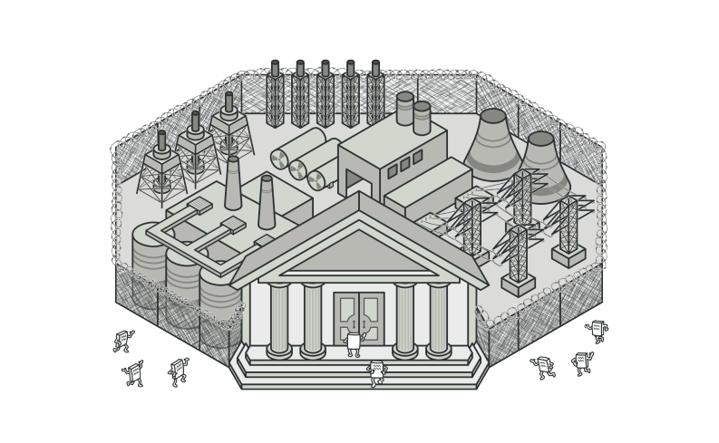
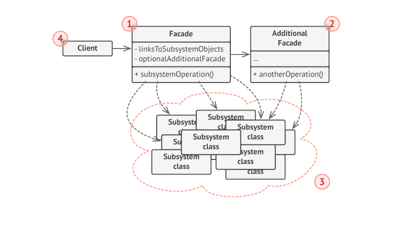

# Facade

> **Facade** is a Structural Design pattern that provides a simplified interface to a library,  a framework or any other complex set of classes.

### Problem

Image that you must make your code work with broad set of Objects that belong to a sophisticated library or framework. Ordinarily you would need to initialize all of these Objects, keep track of dependencies, execute methods in the correct order, and so on.

As a result, the business logic of your classes would become tightly coupled  to the implementation details of 3rd party classes, making it hard to comprehend and maintain.

### Solution

A **Facade** is a Class that provides a simple interface to a complex subsystem which contains lots of moving parts. A **facade** might provide limited functionality in comparison to working with subsystem directly. However, it includes only those features that clients really care about.

### Structure

* A **Facade** provides convenient access to particular part of subsystem's functionality. It knows where to direct the client's request and how to operate all moving parts.
* An **Additional facade class** can be created to prevent polluting a single facade with unrelated features that might make it yet another complex structure. Additional facades can be used by both clients and other facades.
* The **Complex Subsystem** consists of dozens of various Objects. To make them all do something meaningful, you have to dive deep into the Subsystem's implementation details, such as initializing objects in the correct order abd supplying them with data in the proper format. Subsystems classes are not aware of Facade's existence . They Operate within the system and work with each other directly.
* The **Client** uses Facade instead of calling the subsystem object directly.

### Applicability

* Use the Facade Pattern when you need to have a limited but straight forward interface to a complex system.
* Use the Facade when you want to structure a subsystem into layers.
