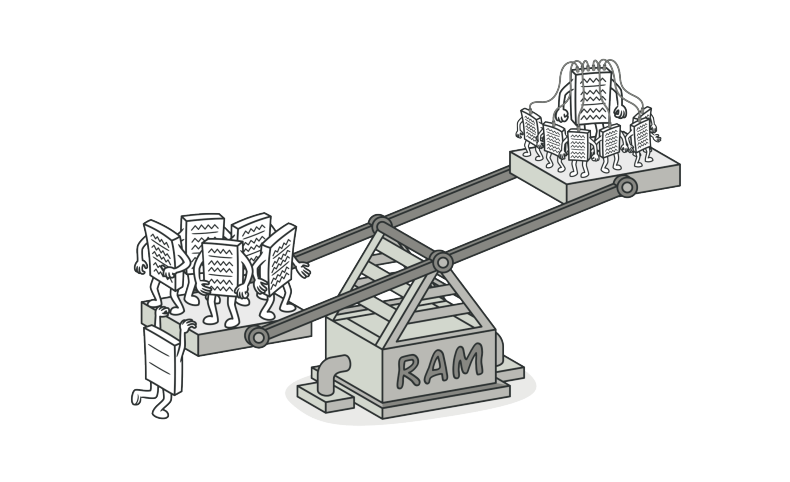
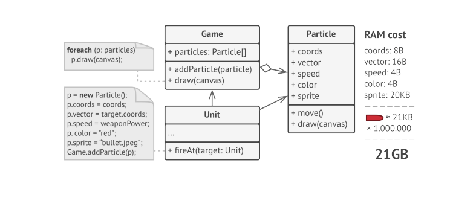
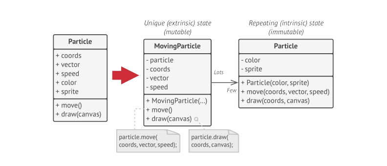
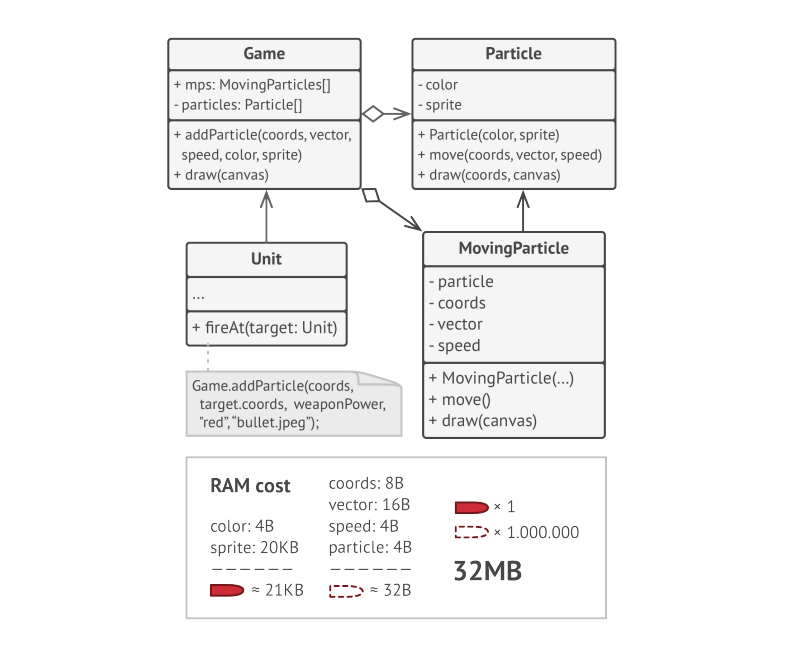
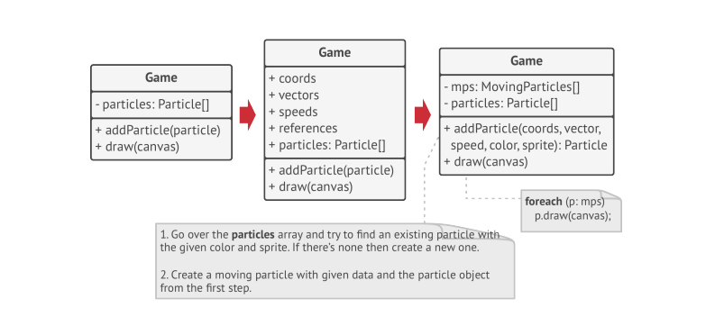
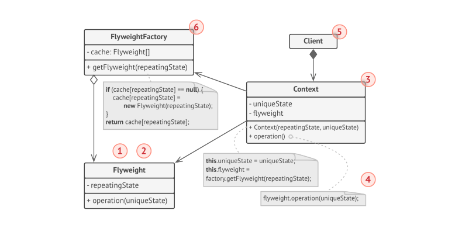

# Flyweight

> **Flyweight** is a structural design pattern that lets you fit more objects into the available amount of RAM by sharing common parts of state between multiple objects instead of keeping all the data in each Object.

### Problem
You decided to create a simple video game. Players would be moving around the map and shooting each other. Vast quantities of bullets, misiles and shrapnel from explosions should fly all over the map and deliver a thrilling experience to the player.

After completing development, you sent that game to your friend for a test drive. On his computer game kept crashing after a few minutes of gameplay. After digging through debug logs, you discovered that the game crashed because of an insufficient amount of RAM. 

The actual problem was related to your particle system. Each **Particle**, such as bullet, a missile or a piece of shrapnel was represented by a separate Object containing plenty of data. At some point, when the carnage on a player's screen reached its climax, newly created particles no longer fit into the remaining RAM, so the progress crashed.

### Solution

On closer inspection of _Particle_ class, you may notice that the color and sprite fields consume a lot more memory than other fields. These 2 fields store almost identical data across all particles.

Other parts of a particle. such as coordinates, movement vector and speed are unique to each particle. This data represents the always changing context in which the particle exists, while color and sprite remain constant for each particle.

This constant data of an Object is usually called the _intrinsic state_. It lived within the Object. Other Objects can only read it, not change it. The rest of the Object's state, often altered from the outside by other Objects, is called the _extrinsic_ state.

The **Flyweight** patten suggests that you stop storing the extrinsic state inside the Object. Instead, you should pass this state to specific methods which rely on it. Only intrinsic state stays within the Object, letting you reuse it in different contexts.

The Object that only stores the intrinsic state is called **Flyweight**.

**Where does the extrinsic state move to?** 

Extrinsic state gets moved to the container Object, which aggregates Objects before we apply the pattern. In our case, that's the main **Game** Object that stores all particles in the _particles_ field. To move extrinsic state into this class, you need to create several array fields for storing coordinates, vectors and speed of each individual particle. You need another array to store references to a specific flyweight that represents a particle. These arrays must be in sync, so that you can access all data of a particle using the same index.

A more elegant solution is to create a separate context class that would store the extrinsic state along with the reference to a flyweight Object. This approach would require having just a single array in the container Class.

The most memory-consuming fields have been moved to just a few flyweight Objects. Now a thousand small contextual Objects can reuse a single heavy flyweight Object instead of storing a thousand copies of its data.

**Flyweight and immutability**

Since the same flyweight Object can be used in different contexts, you have to make sure that it's state can't be modified. A flyweight should initialize its state just once via constructor parameters. It shouldn't expose any setters or public fields to other Objects.

**Flyweight Factory**

For more convenient access to various flyweights, you can create a factory method that manages a pool of existing flyweight Objects.

### Structure

* The **Flyweight** class contains the portion of the original Object's state that can be shared between multiple Objects. The same flyweight Object can be used in many contexts. The state stored inside a flyweight is called "intrinsic". The state passed to flyweight's methods is called "extrinsic".
* The **Context** class contains the extrinsic state, unique across all original Objects. When context is paired with one of the flyweight Objects, it represents the full state of the Original Object.
* The Behavior of the original Object remains in the flyweight class. In this case who ever calls the flyweight's method must also pass appropriate bits of the extrinsic state into the method's parameters. On the Other ahnd the behavior can be moved to the Context class, which would use the linked flyweight merely as data Object.
* The **Client** calculates or stores the extrinsic state of the flyweights. From the client's perspective, a flyweight is a template Object which can be configured at the runtime by passing some contextual data into parameters of its methods.
* The **Flyweight Factory** manages a pool of existing flyweights. With the factory clients don't create flyweights directly. Instead, client calls the factory, passing it bits of the intrinsic state of the desired flyweight. The factory looks over previously created flyweights and either returns an existing one that matches the search criteria or creates new one if nothing is found.

### Applicability

* Use the Flyweight Pattern only when your program must support a huge number of Objects which barely fit into available RAM.

