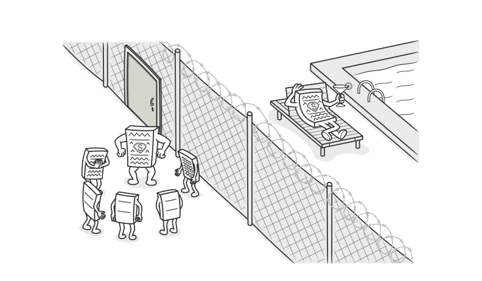
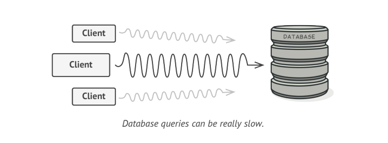
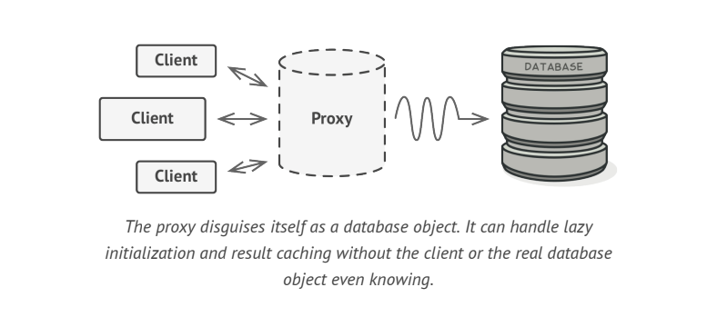
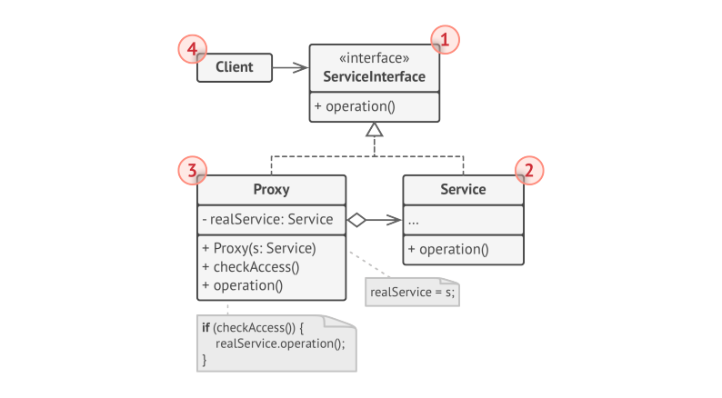

# Proxy

> **Proxy** is structural design pattern that lets you provide a substitute or placeholder for other Object. A proxy controls access to the original Object, allowing you to perform something either before or after the request gets through to the original Object.

### Problem

You have a massive Object that consumes a vast amount o system resources. You need it from time to time, but not always.

You could implement lazy initialization(create object only when it is actually needed). All the Object's clients would need to execute some deferred initialization code. Unfortunately this would probably cause a lot of code duplication.

### Solution

The Proxy pattern suggests that you create a new proxy class with the same interface as an original service Object. Then you update your app so that it passes the proxy Object to all original Object's clients. Upon a receiving request from Client, the proxy created a real service Object and delegates all the work to it.

The main benefit of using Proxy pattern is if you need to execute something either before or after the primary logic of the class, the proxy lets you do this without changing that class. Since Proxy implements same interface as the original class, it can be passed to any client that expects real service Object.

### Structure

* The **Service Interface** declares the interface of the Service. The Proxy must follow this interface to be able to disguise itself as the service Object.
* The **Service** is a Class that provide some useful business logic.
* The **Proxy** class has a reference field that points to a service Object. After proxy finishes its processing, it passed the request to the service Object. Usually Proxies manage the full lifecycle of their service Objects.
* The **Client** should work with both services and proxies via the same interface. This way you can pass a proxy into any code that expects a service object.

### Applicability

* Lazy initialization(virtual proxy). This is when you have heavyweight service object that wastes system resources by being always up, even though you only need it from time to time. Instead of creating the Object when the app launches, you can delay Object's initialization to time when it's actually needed.
* Local execution of remote service(remote proxy). This is when service Object is located on remote server. In this case, the proxy passed the client request over the network, handling all the nasty details of working with network.
* Caching request results(caching proxy). This is when you need to cache results of client requests and manage lifecycle of this cache, especially if results are quite large. The proxy can implement caching for recurring requests that always yields same results. The Proxy may use the parameters of requests as cache keys.
